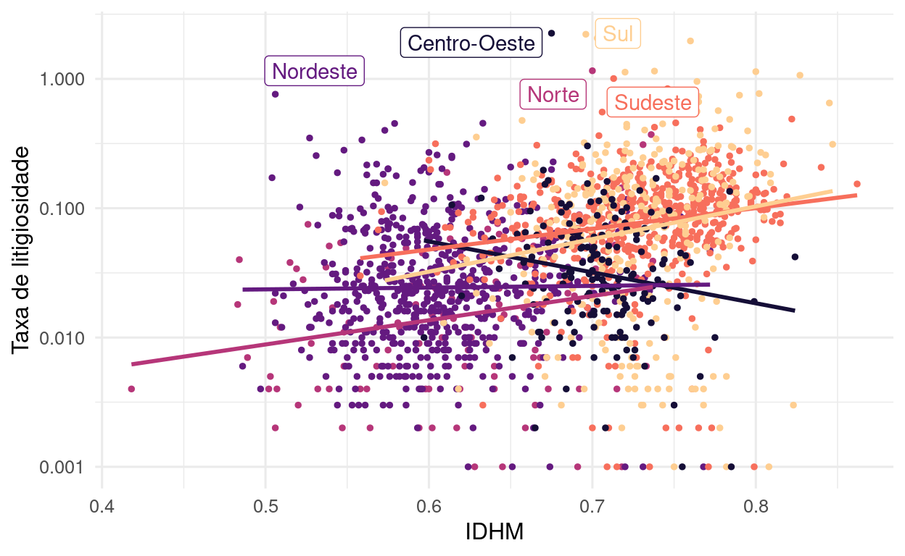
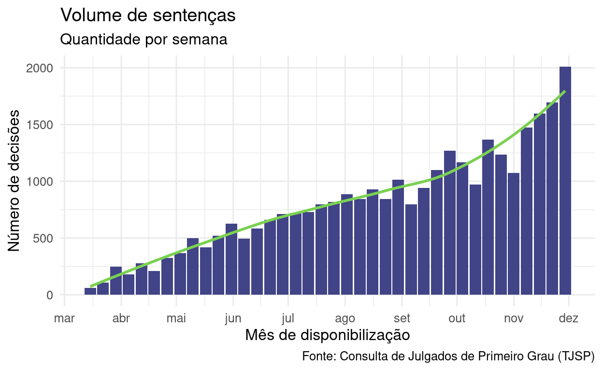
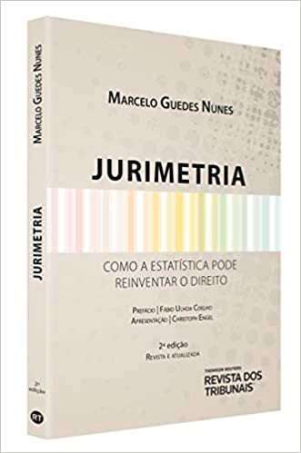

class: center, middle, inverse

# Sobre a disciplina

---

## O que estamos fazendo aqui?

A jurimetria é a estatística aplicada ao direito. 

Mas como se faz jurimetria na prática? Neste semestre, tentaremos responder a essa pergunta. 

Nossa jornada começa com as definições básicas de jurimetria e, através de diversos exemplos, discutiremos todos os aspectos de pesquisa científica e estatística envolvidos.

Ao final das aulas, você seja capaz de construir boas perguntas de pesquisa, planejar um estudo jurimétrico e desenhar o passo-a-passo para realizá-lo na prática. 

Não teremos aulas de programação e aspectos matemáticos/estatísticos serão discutidos de forma intuitiva.

---

## Dinâmica das aulas

- Mande dúvidas e comentários no chat em qualquer momento.

- Para falar, levante a mão.

- Algumas dúvidas serão respondidas na hora. Outras serão respondidas mais tarde na própria aula ou em aulas futuras.

- Só interrompa quem estiver falando em caso de emergência.

---

## Por onde vamos?

Jurimetria não é software, é processo. Vamos aprender como esse processo funciona e quais aspectos devemos levar em conta em cada estudo.

<center>

</center>   

---

## O que faremos?

<center>

<br>

Nosso livro será construído ao longo das aulas:

<br>

<a href='https://livro.ndtj.com.br/'>https://livro.ndtj.com.br/</a>

<br>
<br>

Também faremos novos artigos para o __Lab da ABJ__: 

<br>

<a href='https://lab.abj.org.br'>https://lab.abj.org.br</a>

</center>

<a href="https://lab.abj.org.br/posts/2021-01-15-litigiosidade/">
</img>
</a>

<a href="https://lab.abj.org.br/posts/2020-12-09-covid/">
</img>
</a>

---

## De quais fontes beberemos?

- Livro [Jurimetria:  Como a Estatística pode reinventar o direito](https://www.amazon.com.br/Jurimetria-Marcelo-Guedes-Nunes/dp/8553219992/), de Marcelo Guedes Nunes.

```{r, echo=FALSE, fig.align="center", out.width="25%"}

```

- Livro de [Introdução à Jurimetria com o R](https://jurimetria.consudata.com.br/notes/index.html), de José de Jesus Filho.

- [Cases da ABJ](https://abj.org.br/cases/).

---

## Dinâmica das aulas (2)

- Vários exemplos por aula
  - Estudos da ABJ e projetos de consultoria.
  - Você terá de fazer a **leitura prévia** do estudo discutido em cada aula.
  - Faremos resumos dos estudos para colocar em nosso livro.

- __Avaliação continuada__. Diversos quizzes a serem resolvidos sala de aula.

- __Seminário__. Um trabalho final, a ser entregue na forma de relatório e seminário.
  - Os melhores trabalhos serão colocados no [Lab da ABJ](https://lab.abj.org.br).

---

## Seminário

- Para o seminário, vocês se organizarão em grupos e definirão um tema de pesquisa.

- O tema poderá ser relacionado a alguma disciplina que você está cursando, por exemplo, ou algum tema de seu interesse.

- Vamos desenvolver um estudo jurimétrico simples sobre o tema escolhido.

Entregas:
  - No primeiro bimestre, a entrega será um documento planejando a pesquisa e uma apresentação.
  - No segundo bimestre, a entrega será um documento e uma apresentação.

- Mais detalhes, restrições e opções serão passados na __quarta__ aula.

---

## Composição da nota final:

- __Seminário__: 30%
- __Prova__ (na forma de trabalho): 70%

--

.pull-left[

Daremos 1 ponto __adicional__ para quem resolver todos os quizzes dados em aula.

]

.pull-right[

Daremos 1 ponto __adicional__ para quem entregar 2 resumos ou mais.

]

---

# Tire suas dúvidas

- **Não existe dúvida idiota**.

- Fora do horário de aula:
- Perguntas __sobre a disciplina__: envie suas no Teams.
- Perguntas __sobre jurimetria, estatística e programação__: envie preferencialmente no [Fórum da ABJ](https://forum.abj.org.br).
- Coloque a tag "ndtj"

### Por que usar o Fórum?

- Muito melhor para escrever textos que possuem códigos.

- Mais pessoas acompanhando e respondendo as dúvidas.

- Em um ambiente aberto, as suas dúvidas vão contribuir com a comunidade.

---

class: middle, inverse, center

# Informações adicionais

---
class: middle

## Entidades

.pull-left[

```{r, echo=FALSE, fig.align="center", out.width="80%"}
knitr::include_graphics("https://ndtj.com.br/img/logo.png")
```

[Núcleo de Direito, Tecnologia e Jurimetria /  PUC-SP](https://ndtj.com.br)

]

.pull-right[

```{r, echo=FALSE, fig.align="center", out.width="80%"}
knitr::include_graphics("https://abj.org.br/assets/logo-home.png")
```

[Associação Brasileira de Jurimetria](https://abj.org.br)

]

---

## Alunos - idades

```{r idades-alunos, echo=FALSE, message=FALSE, warning=FALSE, fig.width=7, fig.height=5, dpi=300}
alunosPuc::alunos |>
  dplyr::mutate(
    idade = floor(as.numeric(Sys.Date() - dt_nasc)/365.25),
    idade = cut(idade, c(20, 25, 30, 35, 40), include.lowest = TRUE)
  ) |>
  dplyr::count(turno, idade) |>
  ggplot2::ggplot(ggplot2::aes(x = idade, y = n, fill = turno)) +
  ggplot2::geom_col(
    position = ggplot2::position_dodge2(preserve = "single")
  ) +
  ggplot2::scale_fill_viridis_d(begin = .3, end = .7, option = "A") +
  ggplot2::scale_y_continuous(breaks = c(0:12)*2) +
  ggplot2::theme_minimal(14) +
  ggplot2::labs(
    x = "Idade", y = "Quantidade", fill = "Turma",
  ) +
  ggplot2::theme(legend.position = c(.8,.8))

```

---

## Alunos - semestre

Diurno

```{r, echo=FALSE}
tabelas <- alunosPuc::alunos |>
  tidyr::unnest(disciplinas) |>
  dplyr::filter(stringr::str_detect(nm_disciplina, "DIREITO CIVIL")) |>
  dplyr::distinct(id_matricula, .keep_all = TRUE) |> 
  tibble::add_row(turno = "noturno", nm_disciplina = "Nenhuma") |> 
  dplyr::mutate(
    roman = stringr::str_extract(nm_disciplina, "[IVX]+$"),
    roman = utils::as.roman(roman),
    semestre = as.numeric(roman)
  ) |> 
  dplyr::count(turno, nm_disciplina, semestre, sort = TRUE) |>
  dplyr::arrange(turno, dplyr::desc(semestre)) |>
  dplyr::group_by(turno) |>
  dplyr::mutate(prop = formattable::percent(n/sum(n), digits = 1)) |>
  dplyr::ungroup() |> 
  purrr::set_names(
    c("Turma", "Direito Civil", "Semestre esperado", "N", "%")
  ) |> 
  dplyr::group_split(Turma, .keep = FALSE) |> 
  purrr::map(janitor::adorn_totals) |> 
  # purrr::map(dplyr::mutate, `%` = scales::percent(`%`, .1))
  purrr::map(knitr::kable)


tabelas[[1]]
```

Noturno

```{r, echo=FALSE}
tabelas[[2]]
```

