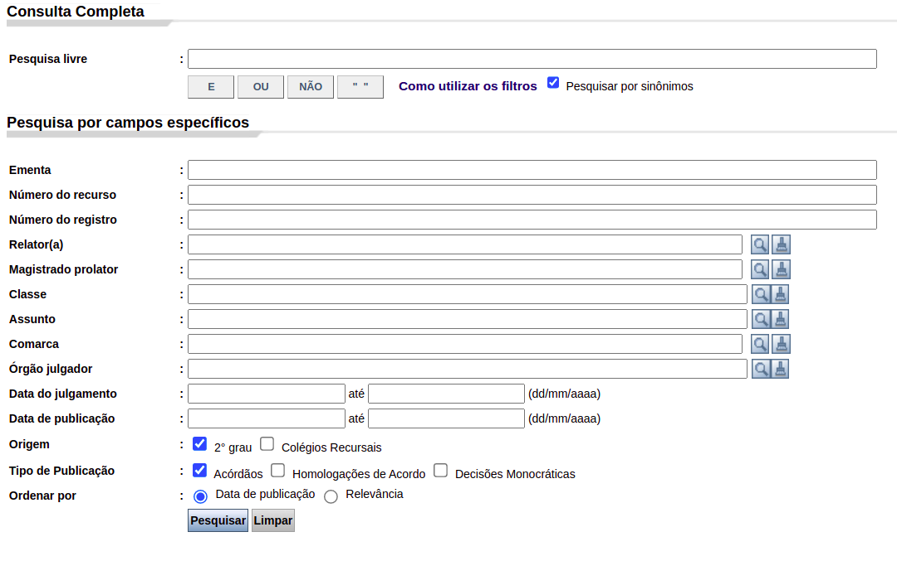
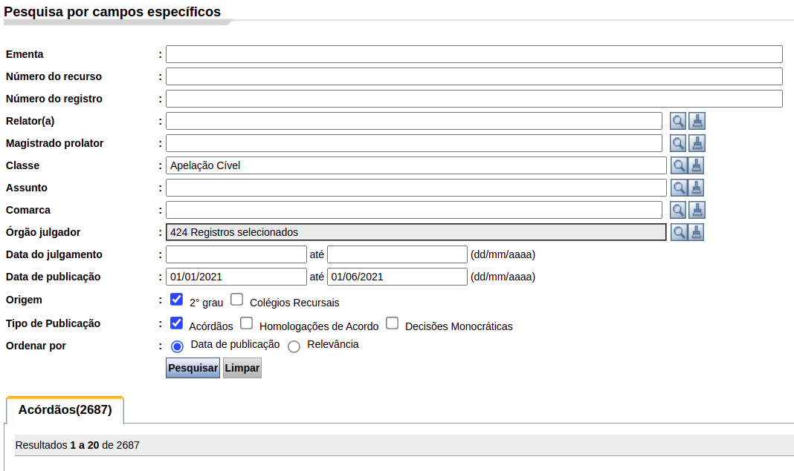

```{r setup, include=FALSE}
knitr::opts_chunk$set(
  echo = FALSE,
  fig.align = "center",
  out.width = "90%",
  message = FALSE,
  warning = FALSE
)

xaringanExtra::use_panelset()
```

```{r meta, echo=FALSE}
library(metathis)
meta() %>%
  meta_general(
    description = "Trabalho final",
    generator = "xaringan and remark.js"
  ) %>% 
  meta_name("github-repo" = "ndtj/main-jurimetria") %>% 
  meta_social(
    title = "Introdução à Jurimetria",
    url = "https://ndtj.github.io/main-jurimetria",
    image = "https://ndtj.com.br/img/logo.png",
    image_alt = "Logo do NDTJ.",
    og_type = "website",
    og_author = "Julio Trecenti",
    twitter_card_type = "summary_large_image",
    twitter_creator = "@jtrecenti"
  )
```


# Sobre o trabalho final

Vamos fazer uma pesquisa jurimétrica!

Na primeira parte, você fará o __planejamento__ de uma pesquisa. Isso envolve definir, em detalhes:

- O tema (título) de sua pesquisa
- Contextualização (aspectos teóricos sobre o tema)
- As perguntas de pesquisa (entre 2 e 4)
- Abrangência: recortes regional, temporal, tema etc
- A forma de coletar os dados
- Descrição dos gráficos que serão analisados 

---

# Coleta de dados

- Vamos considerar a jurisprudência do TJSP como fonte de dados. 
- Por esse motivo, sua pesquisa deve, necessariamente, ser retrospectiva.
- A base de dados deve ser possível de se obter a partir de uma pesquisa na [Consulta de Jurisprudência do TJSP](https://esaj.tjsp.jus.br/cjsg/resultadoCompleta.do).

```{r, out.width="70%"}

```

Você pode considerar outros filtros para obter a base de sua pesquisa, desde que eles estejam disponíveis na lista de variáveis a seguir.

---

# Limites de análise

Sua pesquisa deve ser possível de responder com cruzamentos das seguintes variáveis:

.pull-left[

- Número do processo
- Área do direito (Criminal, Civel)
- Classe
- Assunto
- Câmara
- Relator(a)
- Valor da causa
- Comarca de origem

]

.pull-right[

- Tipo de pessoa no polo ativo
- Tipo de pessoa no polo passivo
- Resultado (reformou, não reformou, etc)
- Unanimidade
- Data da decisão
- Tempo do recurso

]

---

# Exemplo de entrega

.panelset[

.panel[.panel-name[Tema]

Reformas de decisão em acórdãos que citam Covid-19 em 2021.

]

.panel[.panel-name[Contexto]

A pandemia da Covid-19 gerou grandes incertezas e dificuldades para toda a sociedade. Com o judiciário não foi diferente. Neste estudo, vamos avaliar a taxa de reforma de decisões em 2021, identificando se a proporção de reformas varia conforme o assunto ou a câmara. Os resultados serão utilizados para avaliar o grau de insegurança jurídica neste período de incerteza.

]

.panel[.panel-name[Perguntas]

- Quais são os assuntos mais comuns nas decisões analisadas?

- Qual a taxa de reforma em cada câmara?

- Qual a taxa de reforma nos assuntos mais frequentes?


]

.panel[.panel-name[Escopo]

- Pesquisa Livre: "covid" OU "coronavírus"

- Classe: "Apelação Cível"

- Órgão julgador: todas as câmaras de direito privado (424 registros)

- Data de publicação: entre 01/03/2021 e 01/06/2021

]

.panel[.panel-name[Coleta]

__Resultado__: 2687 decisões.

```{r, out.width="90%"}

```


]

.panel[.panel-name[Análises]

- Gráfico de pizza da proporção de cada possível resultado dos recursos.

- Gráfico de barras com volume de decisões em cada mês.

- Tabela com volume de decisões por assunto.

- Gráfico de barras da taxa de reforma por câmara.

- Gráfico de barras da taxa de reforma por assunto.

]

]

---

# Seminário

__Modelo__: *pitch* de vendas (5 minutos). 

- Você deve defender a importância de sua pesquisa. 

- Cada slide será um dos tópicos: Tema, contexto, perguntas, escopo, coleta, análises.

- Uma pessoa é responsável por falar, e

- a(s) outra(s) por responder dúvidas.

__Total__: 8 minutos por grupo.

---

# O que entregar?

- Arquivo em PDF com __até 3 páginas__, contendo todos os elementos pedidos.

- Os RAs da equipe devem ser preenchidos na submissão.

- É uma boa prática mostrar print screens detalhando o processo de coleta.

- O arquivo deverá ser enviado pelo Teams.

---
class: middle, center

# Prazos

### __Data do seminário__: de acordo com o plano de aulas.

### __Data de entrega__: 1 semana após o seminário


