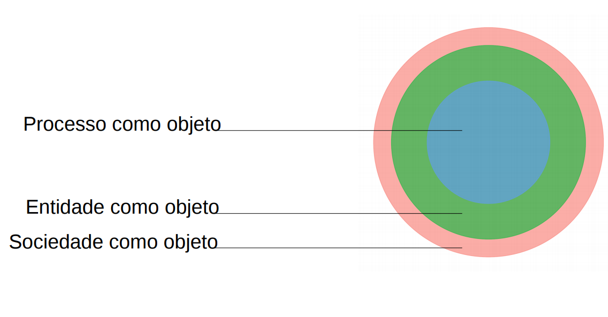

```{r setup, include=FALSE}

library(magrittr, include.only = "%>%")
options(htmltools.dir.version = FALSE)
knitr::opts_chunk$set(
  echo=FALSE, 
  warning=FALSE, 
  message=FALSE,
  out.width = "99%", 
  fig.align = "center",
  dpi = 300
)

crop <- function(im, left = 0, top = 0, right = 0, bottom = 0) {
  d <- dim(im[[1]]); w <- d[2]; h <- d[3]
  magick::image_crop(im, glue::glue("{w-left-right}x{h-top-bottom}+{left}+{top}"))
}

```


```{r}
library(metathis)
meta() %>%
  meta_general(
    description = "Introdução à Jurimetria",
    generator = "xaringan and remark.js"
  ) %>% 
  meta_name("github-repo" = "gadenbuie/drake-intro") %>% 
  meta_social(
    title = "Introdução à Jurimetria",
    url = "https://ndtj.github.io/main-jurimetria/slides/01-introducao-jurimetria.html#1",
    image = "https://ndtj.com.br/img/logo.png",
    image_alt = "Logo do NDTJ.",
    og_type = "website",
    og_author = "Julio Trecenti",
    twitter_card_type = "summary_large_image",
    twitter_creator = "@jtrecenti"
  )
```

## Objetivos da aula

### Apresentar a definição de Jurimetria

### Discutir sobre quem pode se beneficiar e os limites da Jurimetria

### Mostrar algumas aplicações interessantes

---

# O que é jurimetria?

- Jurimetria é a __estatística__ aplicada ao __direito__.

--

- Fazer jurimetria é pensar o direito de forma __concreta__, colocando nosso objeto de estudo no __tempo__ e no __espaço__.

--

<hr/>

.center[
## Exemplo
]

.pull-left[

### Estudo clássico

Princípios jurídicos e pensamento de especialistas sobre o valor de indenização por dano moral a ser concedido no contexto de direito do consumidor.

]

--

.pull-right[

### Estudo jurimétrico

Valores típicos de dano moral em sentenças de primeira instância de processos envolvendo direito do consumidor no Tribunal de Justiça de São Paulo em 2020.

]

--

- A jurimetria __complementa__ o estudo clássico do direito, considerando leis, __princípios__ jurídicos e pensamentos abstratos como __hipóteses__ que se manifestam ou não na __realidade__ através das __decisões__ judiciais.

---

# Stakeholders

A jurimetria auxilia e complementa os trabalhos de todas as pessoas que atuam no universo do direito.

.pull-left[

### Advocacia e empresas

- Cobrança de honorários
- Análise de risco, _due diligence_ e provisionamento.

{{content}}

]

--

### Juristas

- Pareceres jurimétricos.
- Estatística como tecnologia para arguição.

--

.pull-right[

### Magistratura

- Melhores práticas para administração judiciária.
- Aprimoramento das decisões a partir da análise dos dados.

{{content}}

]

--

### Legislativo

- Estudo quantitativo de leis.
- Análise do impacto regulatório.

---

# Abrangência da jurimetria

Pode ser definida através de três esferas de aplicação:

```{r}

```


---

# Abrangência da jurimetria

Pode ser definida através de três esferas de aplicação:

.pull-left[

### Incerteza em um caso

Processo judicial envolve uma questão probabilística.

- Verificação de paternidade.
- Perda de chance.
- Estatística forense.


{{content}}

]

--

### Análise de processos

Análise de bases de dados de processos, estabelecendo relações entre eles.

- Predição de decisões.
- Estratégia advocatícia.
- Caracterização de processos.


--

.pull-left[

### Políticas públicas

Análise de impacto regulatório ou análise do resultado da aplicação de políticas públicas.

- Análise de impacto de leis.
- Proposição de medidas.
- Administração judiciária.


{{content}}

]

--

### &nbsp;

> A aplicação em políticas públicas se conecta com __outras áreas__ do conhecimento, como ciência política e economia.

---

# Limites

&nbsp;

> A jurimetria __não substitui__ a pesquisa clássica no direito. Trata-se de um __complemento__ à pesquisa clássica, não uma alternativa.

--

&nbsp;

> A jurimetria não se limita à análise __processos judiciais__. O objeto de estudo pode envolver processos administrativos, leis e outras bases de dados. No entanto, como a análise de processos judiciais é a mais comum, temos um foco nesses conceitos e definições.

--

&nbsp;

> A jurimetria é __diferente__ de Análise Econômica do Direito (AED). Enquanto a AED toma o direito como objeto na __perspectiva econômica__, a jurimetria __emerge diretamente__ do direito, utilizando a estatística como __ferramenta__.

---
class: inverse, middle

# Cases

---

# Adoção

__Objetivo__: Analisar o tempo dos processos relacionados à adoção no Brasil.

```{r adocao, out.width='60%', fig.cap="Na parte vermelha, o gráfico mostra a distribuição das idades das crianças disponíveis em abrigos. Na parte azul, o gráfico mostra a distribuição das idades máximas que os pretendentes à adoção aceitam."}
"img/adocao.png" %>% 
  magick::image_read() %>% 
  crop(top = 100, bottom = 110)
```

__Resultado__: Lei 13.509/2017, com medidas que podem reduzir o tempo de processos relacionados à destituição do poder familiar.

---

# Estudo sobre honorários

__Objetivo__: Compreender empiricamente a dinâmica de avaliação de honorários no STJ.

```{r danos-morais, out.width='50%', fig.cap="Probabilidade do STJ decidir por irrisoriedade do valor (vermelho), não avaliar o caso (Súmula 7, azul) ou pela exorbitância do valor (verde)."}
"img/danos_morais.png" %>% 
  magick::image_read() %>% 
  crop(top = 10, bottom = 10)
```

__Resultado__: Utilização dos resultados como forma de negociação em caso estratégico.

---

# Observatório da insolvência

__Objetivo__: Compreender empiricamente o processo da insolvência.

```{r observatorio, out.width='50%', fig.cap="Relação entre remuneração do Administrador Judicial (AJ) e valor total da dívida da recuperanda. O valor máximo de remuneração do AJ deve ser de 5% do valor total da dívida."}
"img/obsfase2.png" %>% 
  magick::image_read() %>% 
  crop(top = 10, bottom = 10)
```

__Resultado__: Pesquisas do Núcleo de Estudo e Pesquisa sobre Insolvência (NEPI-PUC/SP).

---

## Resumo

### Pensar jurimetria é pensar de forma __concreta__

--

### Todas as pessoas podem se beneficiar da jurimetria, de formas diferentes

--

### A jurimetria é complementar ao estudo clássico do direito, e tem limites

--

### A jurimetria pode ser utilizada para elaborar boas políticas públicas, estudos acadêmicos e estratégias advocatícias


---
class: center, middle, inverse

# Extra

---
class: middle, center

## Jurimetria e inteligência artificial

### [Vamos ao fórum!](https://forum.abj.org.br/t/jurimetria-e-inteligencia-artificial/37)

