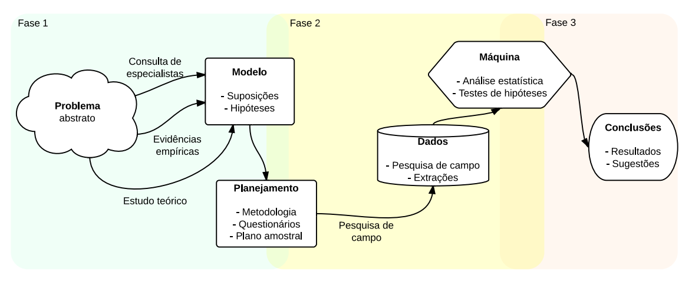
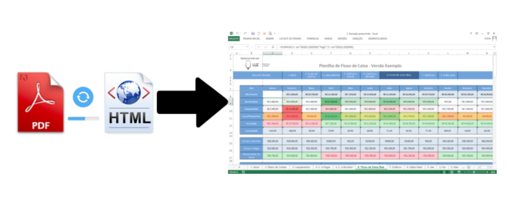

```{r setup, include=FALSE}
knitr::opts_chunk$set(
  echo = FALSE,
  fig.align = "center",
  out.width = "90%",
  message = FALSE,
  warning = FALSE
)

xaringanExtra::use_panelset()

```


```{r meta, echo=FALSE}
library(metathis)
meta() %>%
  meta_general(
    description = "Case 01: Câmaras criminais",
    generator = "xaringan and remark.js"
  ) %>% 
  meta_name("github-repo" = "gadenbuie/drake-intro") %>% 
  meta_social(
    title = "Introdução à Jurimetria",
    url = "https://ndtj.github.io/main-jurimetria/slides/01-introducao-jurimetria.html#1",
    image = "https://ndtj.com.br/img/logo.png",
    image_alt = "Logo do NDTJ.",
    og_type = "website",
    og_author = "Julio Trecenti",
    twitter_card_type = "summary_large_image",
    twitter_creator = "@jtrecenti"
  )
```

# Objetivos de aprendizagem de hoje

#### Compreender o case das __câmaras criminais__.

--

#### Compreender o que é uma distribuição de __probabilidades__, e o que é distribuição __aleatória__.

--

#### Compreender como transcrever uma __pergunta jurídica__ em uma __pergunta jurimétrica__.

---
class: middle

# Guia para os slides

#### Slides sobre o case: __<span style="color:#3B0F70;">marca azul</span>__

#### Slides sobre pesquisa/ciência: __<span style="color:#7AD151;">marca verde</span>__

#### Slides sobre estatística: __<span style="color:#DE4968;">marca rosa</span>__

---
class: center, middle, inverse

# Fluxo de uma pesquisa

---
class: jurimetrics

# Definição de hipóteses

```{r, out.width="100%"}

```


---
class: jurimetrics

# Coleta de dados

.pull-left[

#### Download

```{r, out.width="100%"}
knitr::include_graphics("img/download_esaj.png")
```

]

--

.pull-right[

#### Arrumação

```{r, out.width="100%"}

```

]

--

.center[

#### Visualização / Modelagem

]

```{r, out.width="50%"}
knitr::include_graphics("img/model_esaj.png")
```

---
class: center, middle, inverse

# Sobre o case

---
class: case

# Base de dados

__Recorte regional__: Tribunal de Justiça de São Paulo

__Recorte temporal__: Acórdãos publicados entre 01 de janeiro e 31 de dezembro de 2013.

__Recorte de escopo__: apenas acórdãos relativos a recursos de pessoas contra o Ministério Público, nas 16 câmaras criminais e 4 câmaras extraordinárias.

No final, ficaram 57.625 decisões a serem analisadas.

---
class: case

# Taxa de reforma

A taxa de reforma é calculada pela proporção de decisões em que o resultado é __favorável__.

No entanto, existem algumas nuances

- O que fazer com os casos parcialmente favoráveis? 
- O que fazer com casos que não foram conhecidos?

Para os fins do estudo: não conhecidos e negados foram considerados como __não-reforma__. Todos os outros casos foram considerados como reforma, seja parcial ou total.

---
class: case

# Taxa de reforma por câmara

```{r, out.width="100%"}
p <- tjspCrim::d_final |> 
  dplyr::filter(!stringr::str_detect(orgao_julgador, "Extra")) |> 
  dplyr::count(orgao_julgador, decisao) |> 
  dplyr::mutate(decisao = stringr::str_to_title(decisao)) |> 
  dplyr::group_by(orgao_julgador) |> 
  dplyr::mutate(prop = n/sum(n)) |> 
  dplyr::ungroup() |> 
  dplyr::mutate(
    orgao_julgador = stringr::str_remove_all(
      orgao_julgador, " de Direito Criminal"
    ),
    orgao_julgador = forcats::fct_reorder2(
      orgao_julgador, decisao, prop, \(x,y) max(y[x=="Negaram"])
    ),
    decisao = forcats::lvls_reorder(decisao, c(2,4,3,1)),
    lab = scales::percent(prop, .01)
  ) |> 
  ggplot2::ggplot() +
  ggplot2::aes(prop, orgao_julgador, fill = decisao, text = lab) +
  ggplot2::geom_col() +
  ggplot2::scale_fill_viridis_d(option = "A", begin = .2, end = .8) +
  ggplot2::scale_x_continuous(labels = scales::percent) +
  ggplot2::theme_minimal() +
  ggplot2::labs(
    x = "Proporção", 
    y = "Órgão Julgador",
    fill = "Decisão"
  )

plotly::ggplotly(p, tooltip = "text") |> 
  plotly::layout(
    legend = list(
      orientation = "h",
      y = -.2
    )
  )
```

---
class: case

# Insegurança jurídica?

Partindo-se da premissa de que a distribuição dos recursos é __aleatória__, o fato de câmaras diferentes apresentarem uma diferença significativa nas taxas de reforma é um indício de insegurança jurídica?

--

Pode ser que sim, mas existem alguns pontos que precisamos checar duas coisas. 

1. O que é distribuição aleatória?
1. As câmaras apresentam diferenças de competência (julgam assuntos diferentes)?

---

# Resumo: introdução

- Para realizar uma pesquisa jurimétrica, precisamos definir nossas perguntas de pesquisa antes de realizar a coleta.

- Os parâmetros da coleta precisam ser bem especificados.

- Algumas perguntas podem surgir durante a análise dos dados.

---
class: center, middle

# Quiz 1

```{r, out.width="40%"}
knitr::include_graphics("img/cat.gif")
```

## https://forms.office.com/r/26ZzqdH1Sh 

---
class: center, middle, inverse

# Conceitos estatísticos

---
class: stats

# Probabilidade

Probabilidade é uma __função matemática__ que mede um __evento__.

A função matemática da probabilidade deve atender a dois axiomas, denominados axiomas de Kolmogorov:

1. A probabilidade é um número maior ou igual a zero.

2. A probabilidade do todo é igual a um.

3. A probabilidade da união de eventos disjuntos é a probabilidade da soma destes eventos.

.pull-left[

```{r, out.width="80%"}

```

]

.pull-right[

```{r, out.width="80%"}

```

]

Fonte: [Math goodies](https://www.mathgoodies.com/lessons/vol6/mutually_exclusive).

---
class: stats

# Interpretação da probabilidade

A função matemática da probabilidade é algo imutável. Mas a interpretação da probabilidade pode variar!

.panelset[

.panel[
.panel-name[Interpretação frequentista]

A probabilidade de um evento é o limite de uma frequência relativa.

```{r, out.width="90%"}
set.seed(1)
da_freq <- tibble::tibble(
  trial = 1:100,
  bernoulli = rbinom(100, 1, .5),
  prop = dplyr::cummean(bernoulli)
)

anim <- ggplot2::ggplot(da_freq) +
  ggplot2::aes(trial, prop) +
  ggplot2::geom_line() +
  ggplot2::geom_hline(yintercept = .5, linetype = 2, colour = 2) +
  ggplot2::scale_y_continuous(labels = scales::percent) +
  ggplot2::theme_minimal(12) +
  ggplot2::labs(
    title = "Ensaio: {frame_along}"
  ) +
  gganimate::transition_reveal(trial)

gganimate::animate(anim, nframes = 30, width = 800, height = 400)
```

]

.panel[
.panel-name[Interpretação bayesiana]

A probabilidade é a medida da sua incerteza a respeito da ocorrência de um evento.

```{r, out.width="30%"}

```

]

]

---
class: stats

# Distribuição de probabilidades

.panelset[

.panel[
.panel-name[O que vai acontecer?]

```{r}
x <- magick::image_read("img/atila.gif")
x[1]
```

Fonte: [O segredo da meritocracia](https://www.youtube.com/watch?v=YINTTVjBrY4)

]

.panel[
.panel-name[Resultado]

```{r}
knitr::include_graphics("img/atila.gif")
```

Fonte: [O segredo da meritocracia](https://www.youtube.com/watch?v=YINTTVjBrY4)

]
]

---
class: case

# Distribuição aleatória

No nosso caso, pela leitura da estrutura do TJSP, [__não existe__](https://www.tjsp.jus.br/SecaoDireitoPrivado/SecaoDireitoPrivado/ComposicaoGruposCamaras) uma diferença de competência entre as câmaras criminais ordinárias. Além disso, os recursos são distribuidos aleatoriamente entre câmaras.

--

Como o algoritmo de aleatorização do TJSP é __fechado__, não conseguimos garantir com certeza de que o (ver [este artigo](https://arxiv.org/abs/2008.06709) para uma solução aberta).

--

__Possível solução__: forçamos as __distribuições de assuntos__ (furto, roubo, etc) a serem parecidas em todas as câmaras, e verificamos o impacto na taxa de reforma.

---
class: case

# Simulação no nosso caso

1. Pegamos a distribuição dos assuntos considerando todos os dados. Ou seja, temos a probabilidade de cada assunto ocorrer.

2. Em cada câmara, fizemos uma __reamostragem__, utilizando as probabilidades obtidas em (1). 

Dessa forma, garantimos que todas as câmaras têm a mesma proporção de processos de cada assunto.

---
class: stats

# Resumo: conceitos estatísticos

- Probabilidade é uma função matemática que mede eventos no intervalo entre zero e um.

- Reamostragem é uma técnica utilizada para obter amostras dos dados que estamos analisando, mantendo ou não a mesma distribuição de probabilidades.

- No nosso caso, utilizamos reamostragem para balancear a distribuição dos assuntos em cada câmara.

---
class: center, middle

# Quiz 2

```{r, out.width="40%"}
knitr::include_graphics("img/cat.gif")
```

# https://forms.office.com/r/93Xhda1SdV

---
class: case

# Resultados

Mesmo com a reamostragem, os resultados se mantêm. Ou seja, a variabilidade nas taxas de reforma entre câmaras não pode ser explicada pelos tipos de processos que estão sendo julgados.

Então o que explica a variabilidade taxa de reforma?

--

Hipótese mais provável: magistrados se agrupam por afinidade, gerando câmaras com __alta unanimidade__.

__Unanimidade__: gira em torno de 95% nas câmaras criminais.

---
class: case

# Insegurança jurídica: revisited

A insegurança jurídica, no nosso caso, reside no fato da câmara de julgamento ser um fator importante para predizer qual será o resultado do processo, e que isso não tem a ver com os fatos do processo.

Isso é um comportamento indesejado?

--

<hr/>

.center[

#### Insegurança jurídica x produtividade judiciária

#### Necessidade da decisão colegiada

]

<hr/>

---
class: case

# Próximos passos

### Análise dos votos

O que aconteceria se os magistrados fossem __alocados aleatoriamente__ entre câmaras? A taxa de unanimidade cairia ou os magistrados sempre seguem o relator?

--

### Procedência parcial

A definição de reforma/não reforma poderia ser aprofundada a partir da análise do que está sendo reformado. Pode ser que a diferença entre as taxas esteja na __forma de negar__ um recurso, não no que está sendo decidido.

---
class: center, middle, inverse

# Obrigado!

### [Julio Trecenti](mailto:jaztrecenti@pucsp.br)
