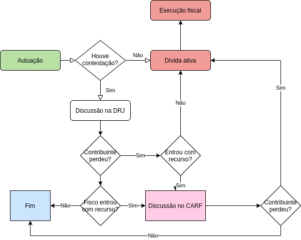
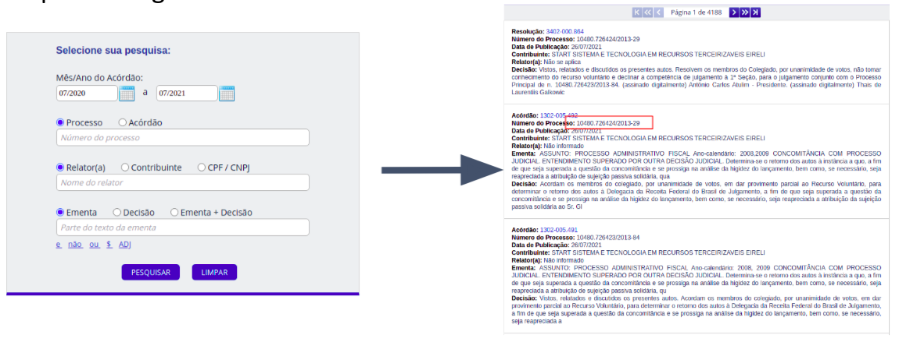
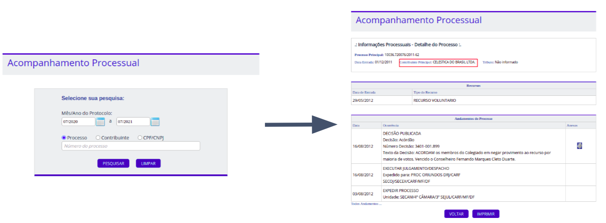
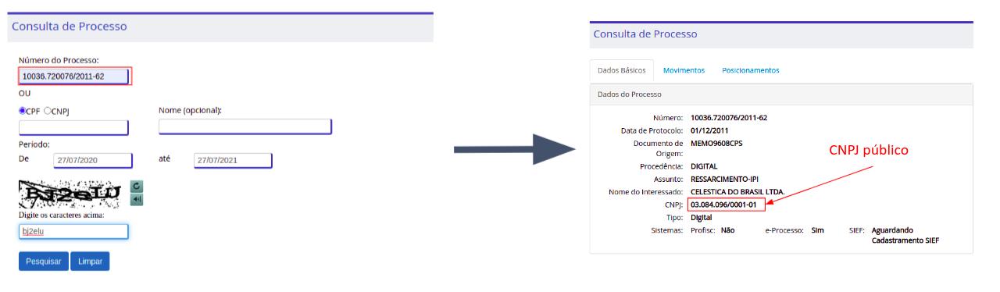
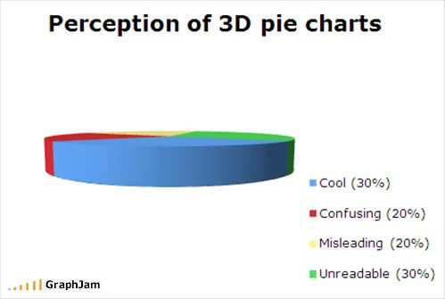
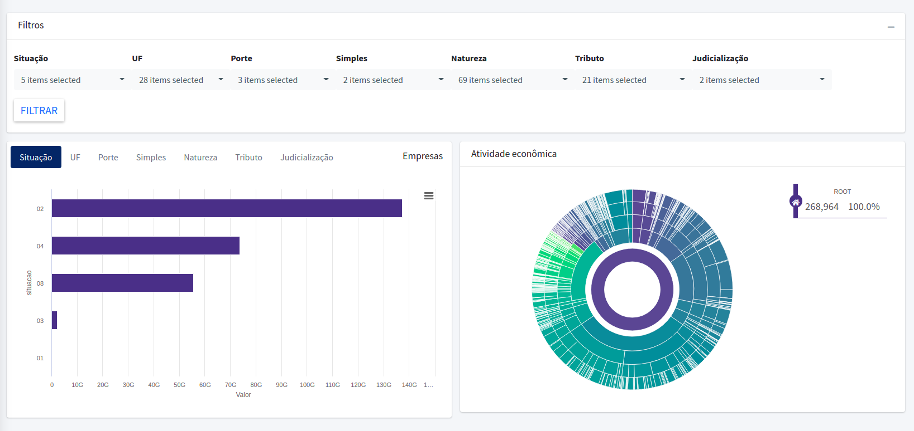

```{r setup, include=FALSE}
knitr::opts_chunk$set(
  echo = FALSE,
  fig.align = "center",
  out.width = "90%",
  message = FALSE,
  warning = FALSE
)

library(ggplot2)
carf <- bidTrib::carf
xaringanExtra::use_panelset()

carfn <- carf |> 
  dplyr::count(autor, vencedor) |> 
  dplyr::mutate(autor = dplyr::case_when(
    autor == "Fisco" ~ "Ofício",
    TRUE ~ "Voluntário"
  )) |> 
  dplyr::group_by(autor) |> 
  dplyr::mutate(prop = n/sum(n)) |> 
  dplyr::ungroup() |> 
  dplyr::filter(vencedor == "Contribuinte") |> 
  dplyr::select(-vencedor)

```


```{r meta, echo=FALSE}
library(metathis)
meta() %>%
  meta_general(
    description = "Case 01: Câmaras criminais",
    generator = "xaringan and remark.js"
  ) %>% 
  meta_name("github-repo" = "gadenbuie/drake-intro") %>% 
  meta_social(
    title = "Introdução à Jurimetria",
    url = "https://ndtj.github.io/main-jurimetria/slides/01-introducao-jurimetria.html#1",
    image = "https://ndtj.com.br/img/logo.png",
    image_alt = "Logo do NDTJ.",
    og_type = "website",
    og_author = "Julio Trecenti",
    twitter_card_type = "summary_large_image",
    twitter_creator = "@jtrecenti"
  )
```

# Objetivos de aprendizagem de hoje

#### Compreender o case do __conselho administrativo de recursos fiscais__.

--

#### Compreender a diferença entre pesquisas populacionais e por amostragem

--

#### Compreender aspectos introdutórios sobre visualização de dados

--

#### Compreender a diferença entre dados públicos e dados abertos

---
class: middle

# Guia para os slides

#### Slides sobre o case: __<span style="color:#3B0F70;">marca azul</span>__

#### Slides sobre pesquisa/ciência: __<span style="color:#7AD151;">marca verde</span>__

#### Slides sobre estatística: __<span style="color:#DE4968;">marca rosa</span>__

---
class: jurimetrics

# Pesquisa populacional e por amostragem

.pull-left[

### Populacional

- Geralmente contém informações mais simples.
- Na maioria dos casos, não existe aplicação de técnicas estatísticas mais sofisticadas.

]

--

.pull-right[

### Amostragem

- Permite uma investigação mais profunda.
- Utiliza técnicas de inferência estatística, para calcular margens de erro e testes de hipótese.

]

--

A decisão entre realizar uma pesquisa populacional ou por amostragem está relacionada com as __perguntas de pesquisa__.

---
class: case

# Sobre o case

- Objetivo: estudar como se distribuem os processos administrativos no CARF.

- Escopo regional: Brasil, já que as decisões do CARF abrangem todos os processos administrativos tributários na esfera federal.

- Escopo temporal: 01/01/2004 até 01/05/2013.

- Principais perguntas: 
    - Quais as diferenças entre o Conselho de Contribuintes e o CARF?
    - A proporção de decisões favoráveis é diferente quando o relator é do fisco?

- Parte da análise é populacional, e parte é por amostragem.

---
class: case

# O que é o CARF?

- O Conselho Administrativo de Recursos Fiscais lida com processos administrativos tributários em segunda instância. 

```{r, out.width="65%"}

```

- O CARF o principal foco de investigações na [Operação Zelotes](https://lab.abj.org.br/posts/2020-01-20-carf/).

---
class: case

# Extração dos dados

```{r}

```

[Link de acesso à consulta de jurisprudência](http://carf.fazenda.gov.br/sincon/public/pages/ConsultarJurisprudencia/consultarJurisprudenciaCarf.jsf)

---
class: case

# Extração dos dados

```{r}

```

[Link de acesso à consulta de processos](https://carf.fazenda.gov.br/sincon/public/pages/ConsultarInformacoesProcessuais/consultarInformacoesProcessuais.jsf)

---
class: case

# Extração dos dados

```{r}

```

[Link de acesso à consulta do Comprot](https://comprot.fazenda.gov.br/comprotegov/site/index.html#ajax/processo-consulta.html)

---
class: case

# Recursos voluntários e de ofício

- Como vimos no diagrama, podem entrar no CARF recursos do contribuinte, chamados __recursos voluntários__, e recursos do fisco, chamados __recursos de ofício__.

- Regra para entrada de recurso de ofício: valor total exonerado a partir de ~~1 milhão de reais (até 2017)~~ 2,5 milhões de reais.

---
class: case

# Viés de seleção

- Como existe uma regra objetiva para entrada de recurso, pode ser que existam recursos de ofício com baixa qualidade.

- Qual o impacto dessa regra na proporção de decisões desfavoráveis nos recursos de ofício?

--

```{r, dpi=300, out.width="75%", fig.width=6, fig.height=4}
carfn |> 
  ggplot() +
  aes(x = autor, y = prop) +
  geom_col(
    fill = viridis::viridis(1, 1, .2, .8, option = "A"),
    width = .5
  ) +
  scale_y_continuous(
    labels = scales::percent_format(accuracy = 1), 
    breaks = seq(0, 1, .1)
  ) +
  theme_minimal(12) +
  geom_hline(yintercept = .5, colour = 2, linetype = 2) +
  labs(
    x = "Tipo de autor",
    y = "Vitórias do contribuinte (%)",
    title = "Vitórias do contribuinte",
    subtitle = "Conselho Administrativo de Recursos Fiscais",
    caption = "Fonte: Elaboração própria"
  )
```

---
class: middle, inverse, center

# Visualização de dados

---
class: stats

# O que é um gráfico estatístico?

Um gráfico estatístico é uma representação visual dos dados por meio de atributos estéticos (posição, cor, forma, tamanho, ...) de formas geométricas (pontos, linhas, barras, ...). Ver: [The Grammar of Graphics](https://www.springer.com/gp/book/9780387245447).

Um gráfico pode ser construído em __camadas__: um gráfico é a sobreposição de elementos visuais. Ver: [A layered grammar of graphics](https://vita.had.co.nz/papers/layered-grammar.html).

---
class: stats

# Camadas

Para construir um gráfico, começamos com o canvas. No R, por exemplo, a função `ggplot()` cria a primeira camada do nosso gráfico: uma tela em branco (cinza).

```{r dpi=300, out.width="50%"}
carfn |> 
  ggplot()
```

---
class: stats

# Camadas

.panelset[

.panel[
.panel-name[Canvas]

```{r dpi=300, out.width="40%"}
carfn |> 
  ggplot()
```

]

.panel[
.panel-name[Canvas (R)]

```{r echo=TRUE, dpi=300, out.width="40%"}
carfn |> 
  ggplot()
```

]

.panel[
.panel-name[Eixos]

```{r dpi=300, out.width="40%"}
carfn |> 
  ggplot() +
  aes(x = autor, y = n)
```

]


.panel[
.panel-name[Eixos (R)]

```{r echo=TRUE, dpi=300, out.width="40%"}
carfn |> 
  ggplot() +
  aes(x = autor, y = prop)
```

]

.panel[
.panel-name[Geometria]

```{r dpi=300, out.width="40%"}
carfn |> 
  ggplot() +
  aes(x = autor, y = prop) +
  geom_col()
```

]

.panel[
.panel-name[Geometria (R)]

```{r echo=TRUE, dpi=300, out.width="40%"}
carfn |> 
  ggplot() +
  aes(x = autor, y = prop) +
  geom_col()
```

]
]

---
class: stats

# Camadas

Depois, podemos trabalhar a estética com temas e detalhamentos.

.panelset[
.panel[
.panel-name[Completo]

```{r, dpi=300, out.width="80%", fig.width=6, fig.height=4}
carfn |> 
  ggplot() +
  aes(x = autor, y = prop) +
  geom_col(
    fill = viridis::viridis(1, 1, .2, .8, option = "A"),
    width = .5
  ) +
  scale_y_continuous(
    labels = scales::percent_format(accuracy = 1), 
    breaks = seq(0, 1, .1)
  ) +
  theme_minimal(12) +
  geom_hline(yintercept = .5, colour = 2, linetype = 2) +
  labs(
    x = "Tipo de autor",
    y = "Vitórias do contribuinte (%)",
    title = "Vitórias do contribuinte",
    subtitle = "Conselho Administrativo de Recursos Fiscais",
    caption = "Fonte: Elaboração própria"
  )
```

]
.panel[
.panel-name[Completo (R)]

```{r, echo=TRUE, eval=FALSE}
carfn |> 
  ggplot() +
  aes(x = autor, y = prop) +
  geom_col(
    fill = viridis::viridis(1, 1, .2, .8, option = "A"),
    width = .5
  ) +
  scale_y_continuous(
    labels = scales::percent_format(accuracy = 1), 
    breaks = seq(0, 1, .1)
  ) +
  theme_minimal(14) +
  geom_hline(yintercept = .5, colour = 2, linetype = 2) +
  labs(
    x = "Tipo de autor",
    y = "Vitórias do contribuinte (%)",
    title = "Vitórias do contribuinte",
    subtitle = "Conselho Administrativo de Recursos Fiscais",
    caption = "Fonte: Elaboração própria"
  )

```

]
]

---
class: stats

# Medidas de posição e variabilidade

.pull-left[

### Medidas de posição

- Resumo que localiza um ponto de interesse no conjunto de dados.

- Exemplos de medidas de posição: média, proporção, mediana, quantis.
    - [Diferença entre média e mediana](https://forum.abj.org.br/t/diferenca-entre-media-e-mediana/84)
    
]

.pull-right[

### Medidas de variabilidade

- Resumo dos dados que mede quanto os números variam, complementando a informação da posição.

- Exemplos de medidas de variabilidade: variância, desvio padrão, coeficiente de variação, diferença inter quartis

]

---
class: stats

.pull-left[

### Análise unidimensional

Estuda a distribuição de uma variável.

Exemplos: gráficos de barras, histogramas, boxplot.

]

.pull-right[

### Análise bidimensional

Estuda a relação entre duas variáveis. Pode se estender a múltiplas variáveis.

Exemplos: gráficos de barras, séries de tempo, gráficos de dispersão.

]

[Este site](https://www.r-graph-gallery.com) é um bom ponto de partida para a visualização de dados.

[Este post](https://forum.abj.org.br/t/ferramentas-uteis-para-graficos/67) apresenta uma série de referências legais para visualização de dados.

---
class: stats

# Pizza

Gráficos de pizza podem parecer legais a princípio, mas podem levar a gráficos pouco legíceis.

```{r, out.width="80%"}

```

[Este post](https://forum.abj.org.br/t/graficos-de-pizza-sao-ruins/41) discute um pouco sobre o tema.

---
class: stats

# Gráficos interativos

```{r}
carf |> 
  dplyr::count(votacao) |> 
  dplyr::mutate(prop = n/sum(n), lab = scales::percent(prop)) |> 
  bidTrib:::pizza()
```

---
class: jurimetrics

# Exemplos de gráficos ruins

Um gráfico ruim geralmente possui uma das seguintes características:

- Distorce os dados, levando a intepretações inadequadas.

- Possui um esquema de cores ruins, que torna a visualização impossível.

- Gráficos de vários eixos, que leva a problemas de [correlação espúria](https://www.google.com/search?q=spurious%20correlation).

[Este post](https://badvisualisations.tumblr.com) é um exemplo de repositório de visualizações ruins.

---

# Quiz

```{r, out.width="40%"}
knitr::include_graphics("img/cat.gif")
```

## https://forms.office.com/r/7ATXi2Y3sK

---
class: inverse, center, middle

# Dados

---
class: jurimetrics

# Dados públicos e abertos

--

.pull-left[

### Dados públicos

- Permitem a consulta individual de processos.
- Garantem o direito da população.
- Exemplo: sistemas de consulta processual.

]

.pull-right[

### Dados abertos

- Facilitam o acesso de bases de dados completas.
- Seguem uma série de parâmetros: [OKFN é uma boa referência](https://okfn.org/opendata/how-to-open-data/).
    - Disponibilidade.
    - Utilização e distribuição.
    - Participação universal.
- Exemplos: https://dados.gov.br, dados abertos da PGFN.

]

.center[

__Discussão__: dados públicos devem ser sempre abertos?

]

---
class: case

# Dados da PGFN

```{r}

```


---
class: jurimetrics

# O futuro dos dados tributários?

- Unificação da taxonomia entre órgãos.

- Padrão de dados abertos.

- Ligação da fase administrativa e da fase judicial.

- Técnicas de resolução amigável de litígios: *cooperative compliance*, mediação, arbitragem, transação, aprimoramento da consulta.

---
class: center, middle, inverse

# Obrigado!

### [Julio Trecenti](mailto:jaztrecenti@pucsp.br)
