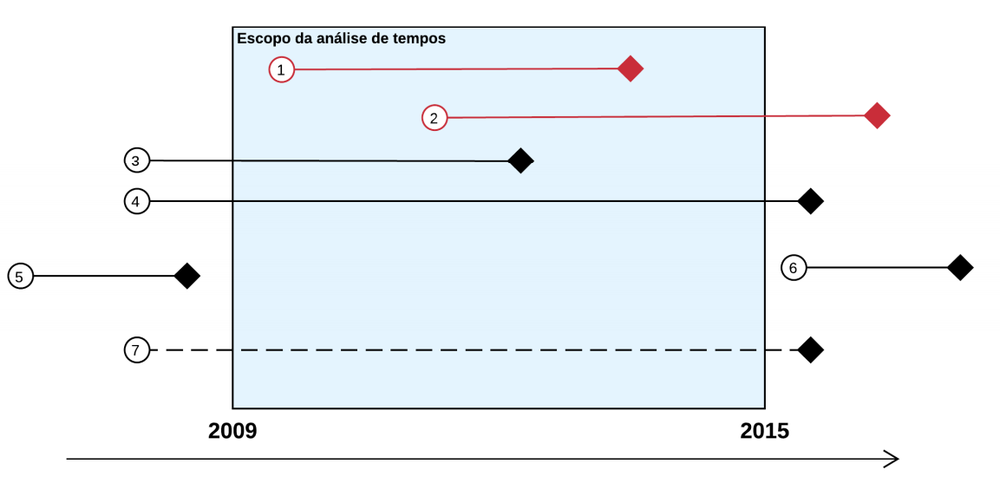

```{r setup, include=FALSE}
knitr::opts_chunk$set(
  echo = FALSE,
  fig.align = "center",
  out.width = "90%",
  message = FALSE,
  warning = FALSE
)

xaringanExtra::use_panelset()
xaringanExtra::use_scribble()
```

```{r meta, echo=FALSE}
library(metathis)
meta() %>%
  meta_general(
    description = "Case 03: Execução de contratos",
    generator = "xaringan and remark.js"
  ) %>% 
  meta_name("github-repo" = "ndtj/main-jurimetria") %>% 
  meta_social(
    title = "Introdução à Jurimetria",
    url = "https://ndtj.github.io/main-jurimetria",
    image = "https://ndtj.com.br/img/logo.png",
    image_alt = "Logo do NDTJ.",
    og_type = "website",
    og_author = "Julio Trecenti",
    twitter_card_type = "summary_large_image",
    twitter_creator = "@jtrecenti"
  )
```


# Objetivos de aprendizagem de hoje

#### Saber o que são indicadores internacionais como o Doing Business

--

#### Compreender sobre estudos prospectivos e retrospectivos

--

#### Compreender como fazemos para analisar tempos

---
class: middle

# Guia para os slides

#### Slides sobre o case: __<span style="color:#3B0F70;">marca azul</span>__

#### Slides sobre pesquisa/ciência: __<span style="color:#7AD151;">marca verde</span>__

#### Slides sobre estatística: __<span style="color:#DE4968;">marca rosa</span>__

---
class: jurimetrics

# O que é um indicador?

- Variável utilizada para medir __mudanças__.

- Nas empresas, temos o jargão KPI, ou *key performance indicators*.

- Pode ser quantitativo ou qualitativo. As definições variam, mas indicadores quantitativos podem ser chamados de __índices__.

--

### O que faz um indicador de qualidade?

- __Precisão__: Evidência objetiva sobre o progresso do fenômeno de interesse.

- __Validade__: Se o indicador subir ou descer, devemos ter a sensação de que a situação melhorou/piorou.

- __Replicabilidade__: Deve utilizar uma metodologia que pode ser replicada no futuro (replicável $\neq$ reprodutível).

--

### Exemplos

- Em um escritório de advocacia: taxa de resultados favoráveis / média geral.

- Sociedade: índice de Gini, índice de desenvolvimento humano.

---
class: jurimetrics

# O Doing Business

```{r}

```

Link: [Doing Business](https://portugues.doingbusiness.org/pt/doingbusiness)

---
class: jurimetrics

# Problema do Doing Business

- É medido a partir das percepções de __especialistas__ sobre o tema.

- O questionário permite a __manutenção__ das percepções nos anos anteriores.

- Existe um __incentivo__ para que as métricas não mudem no tempo.

```{r}

```


---
class: case

# Sobre o case

__Objetivos__:

- Desenvolver uma metodologia reprodutível e estimar as métricas do Doing Business sobre Execução de Contratos, referentes à comarca de São Paulo.

- Produzir um relatório analítico-propositivo com sugestões de alterações legais e administrativas para aprimorar o sistema judiciário no Brasil.

__Recorte temporal__: processos distribuídos entre 2013 e 2019.

__Recorte regional__: comarca da capital, foro central cível.

__Recorte de escopo__: [diversas variáveis](https://abj.org.br/pdf/abj_pnud_db.pdf) relacionadas ao *case* do Doing Business.

---
class: case

# Metodologia

- Obtenção dos dados via diários de justiça e ofício ao TJSP.

- Aplicação dos filtros de escopo

```{r, out.width="50%"}

```

---
class: jurimetrics

# Classe e Assunto

[__Resolução 46__ do CNJ](https://www.cnj.jus.br/sgt/consulta_publica_classes.php): Tabelas Processuais Unificadas (TPU).

```{r, out.width="60%"}

```

__Problema__: [cifra oculta](https://lab.abj.org.br/posts/2020-12-07-cifra-oculta/).

---
class: stats

# Estudo prospectivo e retrospectivo

```{r}

```

- Estudos prospectivos são úteis quando o intuito é estudar o tempo das fases do processo. 

- Já estudos retrospectivos são úteis para a análise do perfil de decisões.

---
class: stats

# Tempos em estudos retrospectivos

.panelset[

.panel[.panel-name[O que observamos]

```{r, fig.width=7, fig.height=4, dpi=300}
set.seed(1)
N <- 400
tabela <- tibble::tibble(
  data_entrada = runif(N, 2010, 2021.5),
  data_saida = data_entrada + rexp(N, 1/5),
  tempo = data_saida - data_entrada
) |> 
  dplyr::mutate(observado = dplyr::if_else(
    data_saida <= 2021.5, "Observado", "Não observado"
  ))

tabela |> 
  dplyr::filter(observado == "Observado") |> 
  ggplot2::ggplot(ggplot2::aes(data_entrada, tempo)) +
  ggplot2::geom_point(
    colour = viridis::viridis(1, 1, .2, .8, 1, "A")
  ) +
  ggplot2::geom_abline(
    slope = -1,
    intercept = 2021.5,
    colour = 2, 
    linetype = 2
  ) +
  ggplot2::scale_x_continuous(breaks = 2010:2021) +
  ggplot2::theme_minimal(12) +
  ggplot2::ylim(c(0,10)) +
  ggplot2::labs(x = "Ano entrada", y = "Tempo (anos)")
```

]

.panel[.panel-name[O que é de verdade]

```{r, fig.width=7, fig.height=4.55, dpi=300}
tabela |> 
  ggplot2::ggplot() +
  ggplot2::aes(data_entrada, tempo, colour = observado,
               alpha = observado) +
  ggplot2::geom_point() +
  ggplot2::geom_abline(
    slope = -1,
    intercept = 2021.5,
    colour = 2, 
    linetype = 2
  ) +
  ggplot2::scale_x_continuous(breaks = 2010:2021) +
  ggplot2::theme_minimal(12) +
  ggplot2::labs(
    x = "Ano entrada", y = "Tempo (anos)", 
    colour = "", alpha = ""
  ) +
  ggplot2::scale_colour_viridis_d(
    option = "A", begin = .2, end = .8, direction = -1
  ) +
  ggplot2::ylim(c(0,10)) +
  ggplot2::scale_alpha_discrete(range = c(.4, 1)) +
  ggplot2::theme(legend.position = "bottom")
```

]


]


---
class: stats

# Análise de tempos

- Quando o estudo é prospectivo, utilizamos uma técnica chamada __análise de sobrevivência__.

- A técnica é capaz de lidar corretamente com casos que ainda estão ativos no momento da análise. Denominamos esses casos como __censura__.

- A censura é capaz de lidar com informações incompletas. No nosso caso, sabemos que um processo ativo nascido em janeiro de 2021 durou __pelo menos 7 meses__ até agora.


---
class: stats

# Gráfico de sobrevivência

```{r}
library(ggalt)
grafico_km <- function(m) {
  cols <- viridis::viridis(2, begin = 0.2, end = 0.8)
  suppressWarnings({
    m |> 
      broom::tidy() |> 
      dplyr::filter(!is.na(conf.high)) |> 
      ggplot2::ggplot(ggplot2::aes(x = time, y = estimate)) +
      ggplot2::geom_ribbon(
        aes(ymin = conf.low, ymax = conf.high), 
        stat = "stepribbon", fill = cols[2], alpha = .3
      ) +
      ggplot2::geom_step(colour = cols[1], size = .5) +
      ggplot2::geom_hline(
        yintercept = .5, 
        colour = "gray50", 
        linetype = 2
      ) +
      ggplot2::scale_x_continuous(n.breaks = 8) +
      ggplot2::labs(x = "Tempo (dias)", y = "Sobrevivência") +
      ggplot2::scale_y_continuous(
        labels = scales::percent, 
        breaks = 0:4*.25, limits = c(0,1)
      ) +
      ggplot2::theme_minimal(14)
  })
}


fit <- survival::survfit(
  survival::Surv(stop/10, event=='pcm') ~1, 
  data = survival::mgus1,
  subset = (start==0)
)

grafico_km(fit) %>% 
  plotly::ggplotly()
```


---
class: stats

# Resumo

- __Indicadores__ são variáveis que medem mudança.

- Estudos __prospectivos__ listam processos a partir do nascimento. Estudos __retrospectivos__ listam processos a partir da morte.

- Análise de __sobrevivência__ é uma técnica útil para análise de tempos em estudos prospectivos.

---
class: case

# Resultados gerais da pesquisa

- Tempo de citação encontrado similar à percepção. Tempo da fase de conhecimento muito menor. Tempo da fase de execução muito maior.

```{r}
readxl::read_excel("img/preenchimento_db.xlsx") |> 
  dplyr::filter(Grupo == "Tempo") |> 
  dplyr::select(-c(1,2)) |> 
  knitr::kable()
```

- Proposta de reduzir tempo do Brasil, o que melhora a posição do país na métrica de Execução de Contratos.

---
class: case

# Proposições de políticas públicas

- Ampliação da competência das varas especializadas

- Abertura de dados do judiciário

- Modificação de prazos processuais

- Regulamentações sobre adiamentos

- Roteiro para audiência de conciliação

- Citação e intimação pessoal por meio eletrônico

- Peticionamento eletrônico

Veja o relatório para acessar fundamentação e discussões.

---

# Quiz

```{r, out.width="40%"}
knitr::include_graphics("img/cat.gif")
```

## https://forms.office.com/r/GKGNgMhexd

---
class: center, middle, inverse

# Obrigado!

### [Julio Trecenti](mailto:jaztrecenti@pucsp.br)
