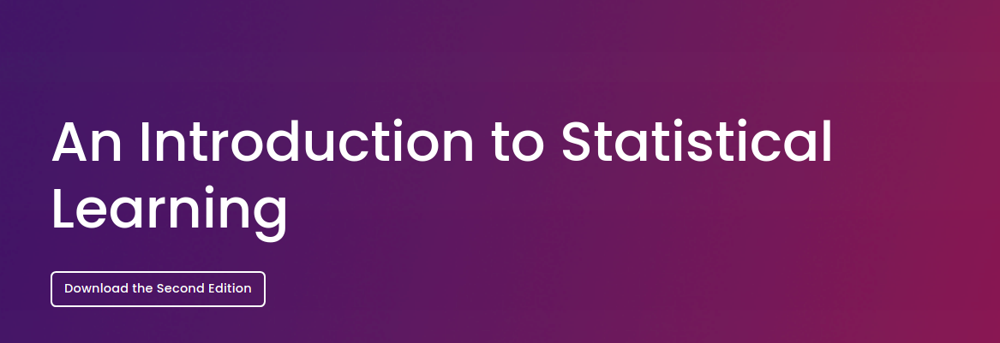
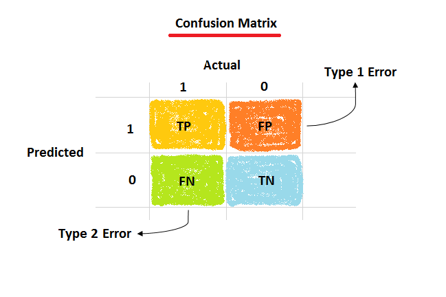

```{r setup, include=FALSE}
knitr::opts_chunk$set(
  echo = FALSE,
  fig.align = "center",
  out.width = "90%",
  message = FALSE,
  warning = FALSE
)

xaringanExtra::use_panelset()
xaringanExtra::use_scribble()
```

```{r meta, echo=FALSE}
library(metathis)
meta() %>%
  meta_general(
    description = "Case 04: Modelos preditivos",
    generator = "xaringan and remark.js"
  ) %>% 
  meta_name("github-repo" = "ndtj/main-jurimetria") %>% 
  meta_social(
    title = "Introdução à Jurimetria",
    url = "https://ndtj.github.io/main-jurimetria",
    image = "https://ndtj.com.br/img/logo.png",
    image_alt = "Logo do NDTJ.",
    og_type = "website",
    og_author = "Julio Trecenti",
    twitter_card_type = "summary_large_image",
    twitter_creator = "@jtrecenti"
  )
```


# Objetivos de aprendizagem de hoje

#### Contextualizar sobre a aplicação de jurimetria em empresas

#### Conhecer como funcionam e para que servem modelos preditivos

#### Conhecer o funcionamento geral de dashboards

---
class: middle

# Guia para os slides

#### Slides sobre o case: __<span style="color:#3B0F70;">marca azul</span>__

#### Slides sobre pesquisa/ciência: __<span style="color:#7AD151;">marca verde</span>__

#### Slides sobre estatística: __<span style="color:#DE4968;">marca rosa</span>__

---
class: jurimetrics

# Lawtechs

- [AB2L](https://ab2l.org.br/radar-lawtechs/) surgiu em 2016
- Brasil apresenta um dos maiores mercados mercados

```{r}
knitr::include_graphics("img/lawtechs.png")
```

---
class: jurimetrics

# Ciclo de maturidade de dados

```{r, out.width="60%"}
knitr::include_graphics("img/maturidade-dados.png")
```

---
class: jurimetrics

# Cenário atual

- Por conta da dificuldade de acesso aos dados, ainda existe oportunidade para empresas especializadas em __extração de dados__.

- A maior parte das aplicações que vimos hoje são relacionadas a __visualização de dados__, com algumas aplicações pontuais de __modelagem__.

--

- A tomada de __decisão baseada em dados__ ainda é bastante incipente no mercado atual (mesmo que as empresas não falem isso explicitamente).

> Fake it until you make it.
> 
> Simon & Garfunkel (?)

---
class: jurimetrics

```{r}

```

---
class: case

# Sobre o case

__Objetivos__: Visualização e modelagem de dados a partir de uma base de uma lista de processos enviada pela Vivo.

__Recorte temporal__: processos distribuídos entre 2009 e 2019.

__Recorte regional__: Processos distribuídos em 6 comarcas distintas: Fernandópolis, Jales, Palmeira D'Oeste, Presidente Prudente, Santa Fé do Sul e São José do Rio Preto.

__Recorte de escopo__: Processos relacionados a direito do consumidor com a Vivo no polo passivo.

---
class: stats

# Ciclo da ciência de dados

```{r}
knitr::include_graphics("img/ciclo-ciencia-de-dados.png")
```


---
class: stats

# O Dashboard

```{r}
knitr::include_graphics("img/vivopoc.gif")
```

---
class: stats

# Modelagem preditiva

- Área da estatística destinada à construção de __modelos estatísticos__ capazes de fornecer boas predições para determinado fenômeno.

- Melhor introdução para o tema: [ISLR](https://www.statlearning.com)

```{r}

```

- __Machine learning__ e __statistical learning__ são __sinônimos__.

---
class: stats

# O que é um modelo preditivo?

Paradigma programação vs paradigma do aprendizado estatístico.

.pull-left[

```{r}
knitr::include_graphics("img/ia_esquerda.png")
```

]

--

.pull-right[

```{r}
knitr::include_graphics("img/ia_direita.png")
```

]

---
class: stats

# Mas e as redes neurais?

- Redes neurais / deep learning é uma área de aprendizado de máquinas (aprendizado estatístico).

```{r, out.width="60%"}
knitr::include_graphics("img/artificial-intelligence.png")
```

---
class: stats

# Mas e a inteligência artificial?!

```{r, out.width="60%"}
knitr::include_graphics("img/ml-stats.jpeg")
```

A inteligência artificial *está* machine learning nos dias de hoje.

---
class: stats

# A única fórmula que você verá aqui

- Nós temos inputs e outputs, e queremos predizer um output que ainda não existe a patir de um input que temos em mãos.

- Por exemplo, queremos predizer o resultado de um processo (output) com base nas suas características (input).

- Geralmente associamos os inputs à variável $X$ e os outputs à variável $Y$.

- Queremos criar uma função (uma fórmula) $g$ que, a partir de um $X$, consegue dar um valor de $Y$

$$Y = g(X)$$

---
class: stats

# Sobreajuste

Para isso, podemos aplicar um modelo super complexo, que se ajusta perfeitamente aos dados que eu observo, como se cada caso fosse um caso...

```{r, out.width="80%"}
knitr::include_graphics("img/overfiting_sem_teste.gif")
```

Fonte: [Curso-R](https://curso-r.com)

---
class: stats

# Erro de generalização

- Um modelo de aprendizado estatístico precisa funcionar bem para bases que nós __não observamos__. Para isso, tentamos criar um modelo que se adeque bem aos dados que observamos.

```{r}

```

---
class: stats

# Sobreajuste

... mas quando eu vou aplicar isso no mundo real, os modelos mais complicados não se aplicam.

```{r, out.width="80%"}
knitr::include_graphics("img/overfiting_com_teste.gif")
```

Fonte: [Curso-R](https://curso-r.com)

---
class: stats

# Sobreajuste

No fundo, preciso escolher um modelo que seja suficientemente complexo para captar o __sinal__ (tendência) do fenômeno estudado, sem com isso fazer com que meu modelo seja suscetível a __ruídos__ (erros aleatórios),

```{r}
knitr::include_graphics("img/overfiting_scatter_eqm.gif")
```

Fonte: [Curso-R](https://curso-r.com)

---
class: stats

# Treino e teste

- Para lidar com esse problema, separamos nossa base em duas: uma base de __treino__ e uma base de __teste__. 

- Na base de treino, ajustamos nosso modelo. Na base de teste, testamos o quão bom está o modelo. Dessa forma, não tem como sermos enganados pelo sobreajuste.

- A base de treino, por sua vez, passa por um procedimento chamado __validação cruzada__, que consiste em testar vários modelos escondendo uma parte da base de treino e testando os melhores candidatos.

---
class: jurimetrics

# Métricas de qualidade de um modelo

- Nem sempre o melhor modelo é aquele que acerta mais!

- A métrica depende do problema estatístico (regressão, classificação) e do __problema de negócio__.

- __Exemplo__: acurácia, falso positivo e falso negativo

```{r, out.width="65%"}

```

Fonte: [Machine learning Model Performace Metrics](https://medium.com/nerd-for-tech/machine-learning-model-performance-metrics-84f94d39a92)

---
class: case

# Voltando ao case

```{r}

```

- Acurácia do modelo: 88%. É bom?

- Precisão do modelo: 89%.

---
class: case

# Aprendizado estatístico interpretável

Art. 20 da LGPD: 

> § 1º O controlador deverá fornecer, sempre que solicitadas, informações claras e adequadas a respeito dos critérios e dos procedimentos utilizados para a decisão automatizada, observados os segredos comercial e industrial.


- Conforme obtemos mais dados, conseguimos ajustar modelos cada vez mais complexos.

- Modelos mais complexos são mais difíceis de interpretar: não tem só um $X$ para explicar o $Y$, e as funções $g$ podem ser bem complicadas de ler por seres humanos.

---
class: case

# Machine Leaning Interpretável

Uma das áreas de pesquisa que mais cresce na atualidade é a de intepretação de modelos. O problema de *fairness* é igualmente relevante, e também é levada em conta na área de interpretabilidade.

Livro: [Interpretable Machine Learning](https://christophm.github.io/interpretable-ml-book/).

```{r, out.width="50%"}
knitr::include_graphics("img/iml.jpg")
```

---

# Resumo

- Aprendizado de máquinas é o mesmo que __aprendizado estatístico__, e inteligência artificial é uma área do conhecimento que contém como área mais importante (atualmente) o aprendizado de máquinas.

- Modelos preditivos buscam minimizar o erro de generalização. Para isso, precisamos separar a base entre __treino__ e __teste__.

- Um modelo pode otimizar __métricas diferentes__, e essas métricas dependem do modelo de negócio.

---

# Quiz

```{r, out.width="40%"}
knitr::include_graphics("img/cat.gif")
```

## https://forms.office.com/r/dYnft5E4Nf

---
class: center, middle, inverse

# Obrigado!

### [Julio Trecenti](mailto:jaztrecenti@pucsp.br)
