```{r setup, include=FALSE}
knitr::opts_chunk$set(
  echo = FALSE,
  fig.align = "center",
  out.width = "90%",
  message = FALSE,
  warning = FALSE
)

xaringanExtra::use_panelset()
xaringanExtra::use_scribble()
```

```{r meta, echo=FALSE}
library(metathis)
meta() %>%
  meta_general(
    description = "Case 05: Adoção",
    generator = "xaringan and remark.js"
  ) %>% 
  meta_name("github-repo" = "ndtj/main-jurimetria") %>% 
  meta_social(
    title = "Introdução à Jurimetria",
    url = "https://ndtj.github.io/main-jurimetria",
    image = "https://ndtj.com.br/img/logo.png",
    image_alt = "Logo do NDTJ.",
    og_type = "website",
    og_author = "Julio Trecenti",
    twitter_card_type = "summary_large_image",
    twitter_creator = "@jtrecenti"
  )
```


# Objetivos de aprendizagem de hoje

#### Apresentar o case da adoção

#### Compreender sobre simulação de cenários

---
class: middle

# Guia para os slides

#### Slides sobre o case: __<span style="color:#3B0F70;">marca azul</span>__

#### Slides sobre pesquisa/ciência: __<span style="color:#7AD151;">marca verde</span>__

#### Slides sobre estatística: __<span style="color:#DE4968;">marca rosa</span>__

---
class: case

# Idades de disponibilização

```{r}
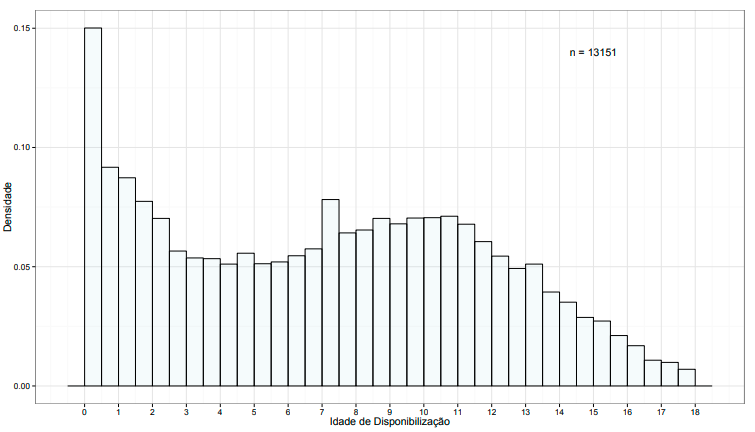
```

---
class: case

# Idades de disponibilização (2)

```{r}
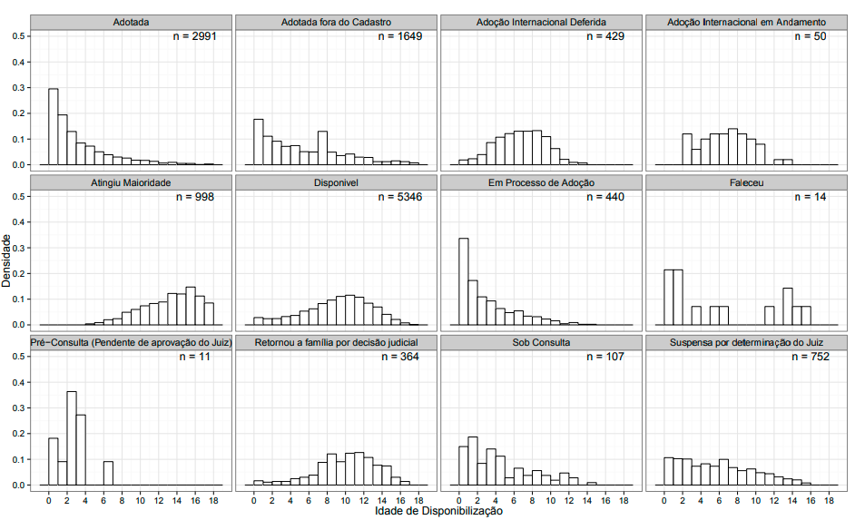
```

---
class: case

# Idades de disponibilização por origem

```{r}
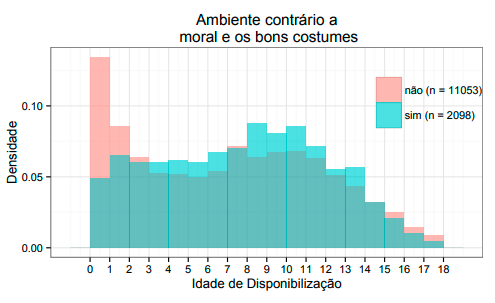
```

---
class: case

# Idades de disponibilização por origem

```{r}
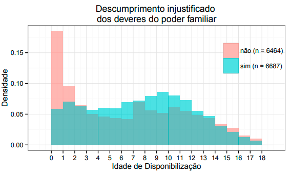
```

---
class: case

# Idades de disponibilização por origem

```{r}
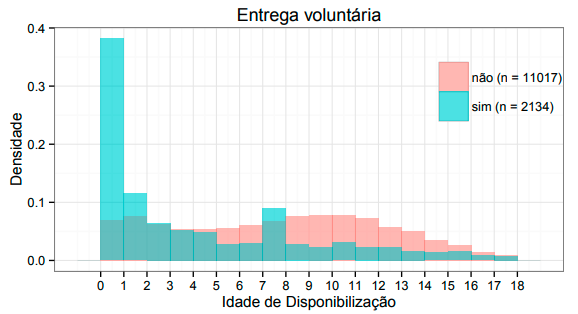
```

---
class: case

# Idades de disponibilização por origem

```{r}
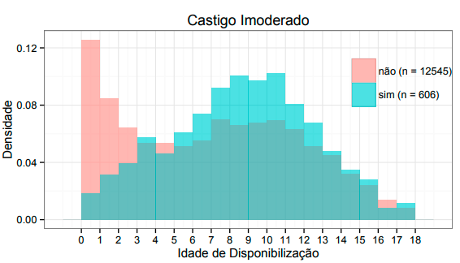
```

---
class: case

# Sobrevivência: regiões

```{r}
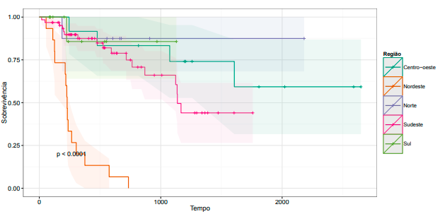
```

---
class: case

# Sobrevivência: São Paulo

```{r}
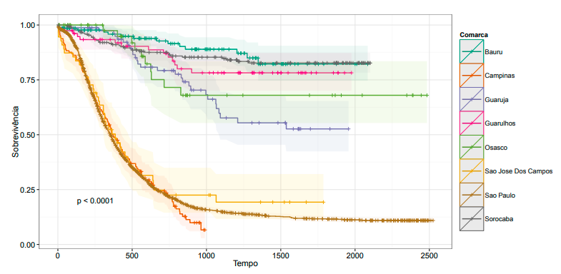
```

---
class: case

# Sobrevivência: Foro Central

```{r}
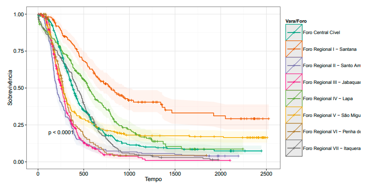
```

---
class: case

# Sobrevivência: especialização

```{r}
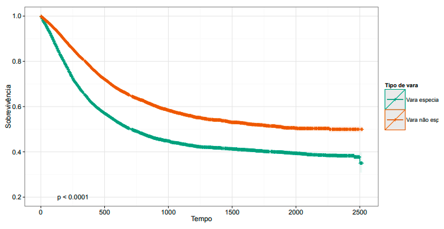
```

---
class: stats

# Simulação

$$N(t)=N(t-1)-M(t-1)-D(t-1)+K(t)$$

- $N(t)$ denota o número de crianças ou adolescentes disponíveis no instante $t$,
- $M(t)$ denota o número de *matchings* realizados no instante $t$,
- $D(t)$ denota o número de adolescentes que atingiram maioridade no instante $t$, e
- $K(t)$ denota o número de crianças ou adolescentes que entraram no cadastro no instante $t$

---
class: case

# Simulação

```{r}
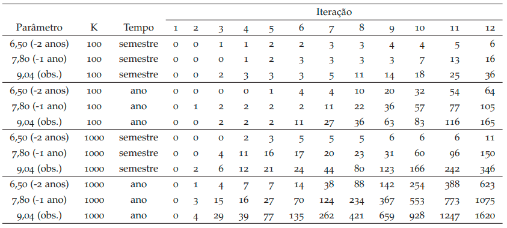
```

---

# Quiz

```{r, out.width="40%"}
knitr::include_graphics("img/cat.gif")
```

## https://forms.office.com/r/PDJcYqd62V

---
class: center, middle, inverse

# Obrigado!

### [Julio Trecenti](mailto:jaztrecenti@pucsp.br)
