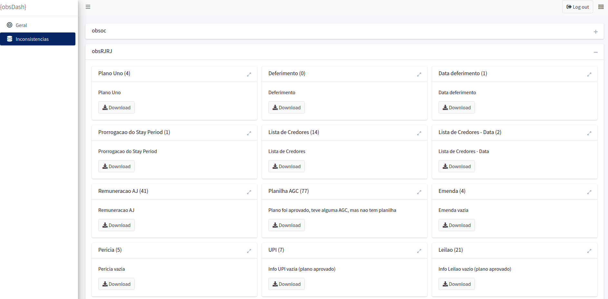

```{r setup, include=FALSE}
knitr::opts_chunk$set(
  echo = FALSE,
  fig.align = "center",
  out.width = "90%",
  message = FALSE,
  warning = FALSE
)

xaringanExtra::use_panelset()
xaringanExtra::use_scribble()
```

```{r meta, echo=FALSE}
library(metathis)
meta() %>%
  meta_general(
    description = "Case 05: Adoção",
    generator = "xaringan and remark.js"
  ) %>% 
  meta_name("github-repo" = "ndtj/main-jurimetria") %>% 
  meta_social(
    title = "Introdução à Jurimetria",
    url = "https://ndtj.github.io/main-jurimetria",
    image = "https://ndtj.com.br/img/logo.png",
    image_alt = "Logo do NDTJ.",
    og_type = "website",
    og_author = "Julio Trecenti",
    twitter_card_type = "summary_large_image",
    twitter_creator = "@jtrecenti"
  )
```


# Objetivos de aprendizagem de hoje

#### Conhecer os observatórios da ABJ

#### Compreender sobre classificação manual de processos

#### Compreender sobre análise de inconsistências

---
class: middle

# Guia para os slides

#### Slides sobre o case: __<span style="color:#3B0F70;">marca azul</span>__

#### Slides sobre pesquisa/ciência: __<span style="color:#7AD151;">marca verde</span>__

#### Slides sobre estatística: __<span style="color:#DE4968;">marca rosa</span>__

---
class: jurimetrics

# Introdução

- Os observatórios da ABJ são estudos que analisam e monitoram processos complexos utilizando jurimetria.

- O objetivo principal dos projetos é esclarecer assuntos complexos e relevantes do Direito, com o intuito de formular melhores políticas públicas.

- Todos os relatórios dos observatórios são disponibilizados publicamente.

---
class: jurimetrics

# Metodologia

1. Formulação de hipóteses, questões norteadoras e plano de execução.

1. Listagem de processos e obtenção da população de casos a serem analisados.

1. Elaboração e validação do questionário, através de aplicação de pré-teste.

1. Coleta e organização dos dados.

1. Análise dos dados obtidos e elaboração do relatório de análise.


---
class: jurimetrics

# Fluxo de trabalho

- Geralmente, os Observatórios são iniciados a partir da identificação de um tema interessante de análise. 

- Em seguida, especialistas no tema formulam hipóteses que levam às questões norteadoras da pesquisa. 

- Essas questões são organizadas em um documento contendo o plano de execução, que é passado para instituições apoiadoras em busca de recursos. 

- Após o levantamento dos recursos necessários, damos início ao cronograma de execução do projeto.

---
class: case

# Insolvência - Recuperações judiciais

```{r, out.width="80%"}
knitr::include_graphics("https://abj.org.br/img/cases/obsfase2.png")
```

---
class: case

# Insolvência - Falências

```{r}
knitr::include_graphics("https://abjur.github.io/obsFase3/relatorio/assets/img/diag-tempos.png")
```

---
class: case

# Mercado de Capitais

```{r, out.width="80%"}
knitr::include_graphics("https://abj.org.br/img/cases/cvm.png")
```

---
class: stats

# Automação

- Leitura, filtros, seleções

- Detecção das inconsistências

- Construção da base de dados arrumada

---
class: stats

# O que é faxina?

**Faxina de dados** é o processo de modificar uma ou mais tabelas até que elas atendam o princípio **tidy**, proposto por Hadley Wickham em um artigo de 2014.

Cada base exigirá uma **Faxina** diferente, pois não existe um único tipo de bagunça:

_Tidy data ~~Happy families~~ are all alike; every untidy data ~~unhappy family~~ is untidy ~~unhappy~~ in its own way (Hadley Wickham ~~Leon Tolstoi~~)_

[Material do curso de faxina de dados](https://curso-r.github.io/202110-faxina/).

---
class: stats

# Por que faxina é importante?

Dados são o subproduto de muitos __processos complexos__, administrado por várias pessoas que podem fazer __usos diferentes__ dos mesmos registros.

Isso faz com que os __formatos__ e __convenções__ de armazenamento de dados sejam muito __variados__, dificultando análises futuras.

Por isso, a Faxina é praticamente uma __constante__ em qualquer contexto de análise de dados, e isso não se deve **só** a erros ou falhas no processo de armazenamento. 

---
class: stats

# O que é um banco de dados **arrumado**

 *Tidy data* é um princípio para arrumação de base de dados que resolve 90% dos problemas reais. Uma base tidy é **uma única tabela** que satisfaz:
 
- Cada observação é uma (e só uma) linha da tabela.

- Cada variável é uma coluna da tabela. Não existe uma coluna que represente duas variáveis, por exemplo. 

Essas definições são relacionadas, a depender do que entendermos por **variável** e **observação**. O que realmente importa é a filosofia por trás das sugestões.

---
class: case

# ObsDash

```{r}

```

---
class: case

# ObsDash

- Serve para acompanhar as inconsistências dos dados

- Corrigimos as informações na fonte de dados, que alimentam os trabalhos.

---

# Quiz

```{r, out.width="40%"}
knitr::include_graphics("img/cat.gif")
```

## https://forms.office.com/r/RHkA3VRkrE

---
class: center, middle, inverse

# Obrigado!

### [Julio Trecenti](mailto:jaztrecenti@pucsp.br)
