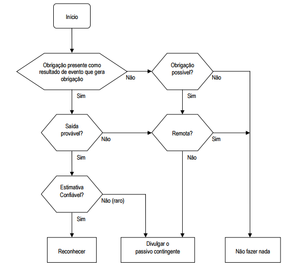
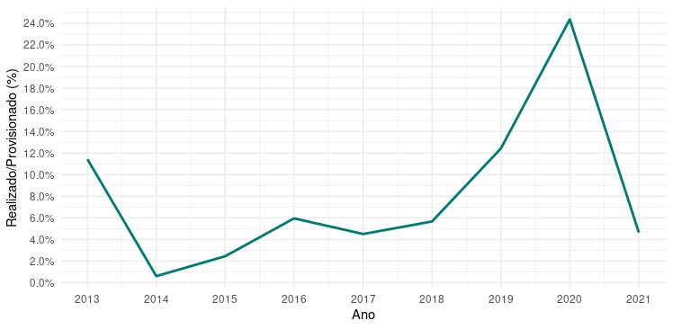
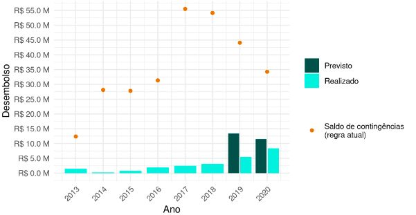
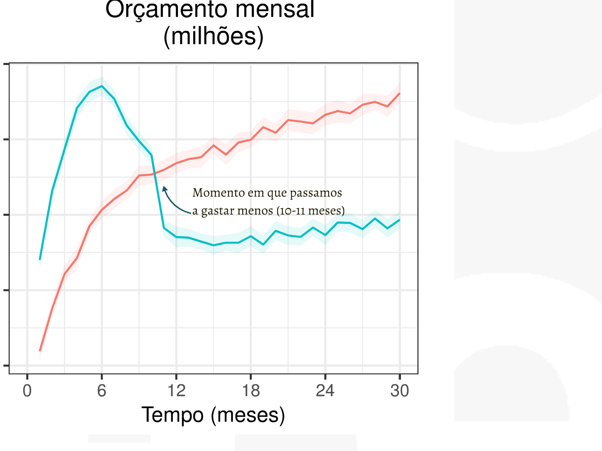
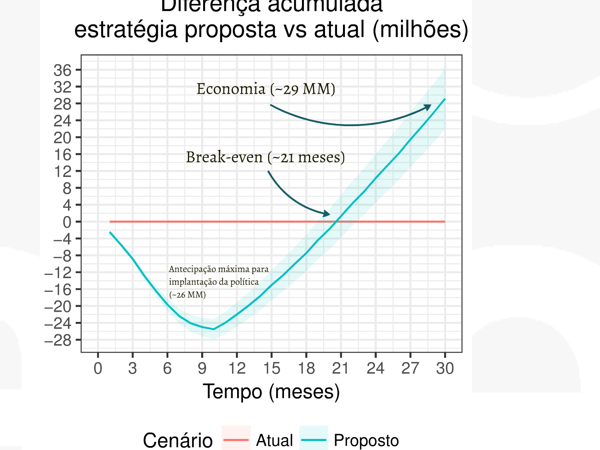
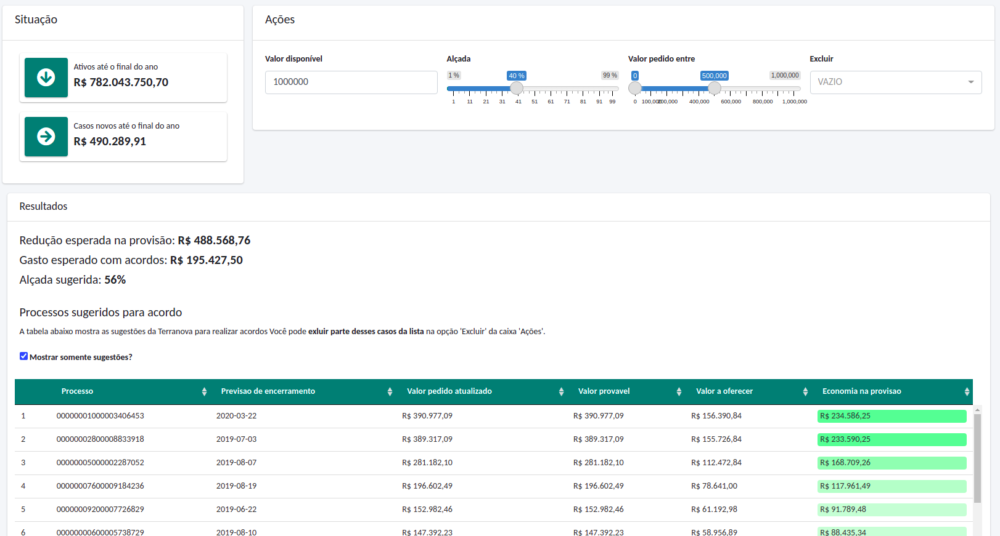

```{r setup, include=FALSE}
knitr::opts_chunk$set(
  echo = FALSE,
  fig.align = "center",
  out.width = "90%",
  message = FALSE,
  warning = FALSE
)

xaringanExtra::use_panelset()
xaringanExtra::use_scribble()
```

```{r meta, echo=FALSE}
library(metathis)
meta() %>%
  meta_general(
    description = "Case 08: Provisionamento e estratégia de acordo",
    generator = "xaringan and remark.js"
  ) %>% 
  meta_name("github-repo" = "ndtj/main-jurimetria") %>% 
  meta_social(
    title = "Introdução à Jurimetria",
    url = "https://ndtj.github.io/main-jurimetria",
    image = "https://ndtj.com.br/img/logo.png",
    image_alt = "Logo do NDTJ.",
    og_type = "website",
    og_author = "Julio Trecenti",
    twitter_card_type = "summary_large_image",
    twitter_creator = "@jtrecenti"
  )
```


# Objetivos de aprendizagem de hoje

### Compreender o funcionamento do provisionamento

### Compreender o conceito de esperança matemática

### Compreender a mecânica em estratégias de acordo

---
class: middle

# Guia para os slides

#### Slides sobre o case: __<span style="color:#3B0F70;">marca azul</span>__

#### Slides sobre pesquisa/ciência: __<span style="color:#7AD151;">marca verde</span>__

#### Slides sobre estatística: __<span style="color:#DE4968;">marca rosa</span>__

---
class: jurimetrics, middle

# Introdução

O [__CPC 25__](http://www.cpc.org.br/CPC/Documentos-Emitidos/Pronunciamentos/Pronunciamento?Id=56) tem como objetivo definir critérios de reconhecimento e bases de mensuração apropriados a provisões e passivos e ativos contingentes.

---
class: jurimetrics

# Provisão

.pull-left[

- __Provisão__ é um passivo de __prazo__ ou de __valor__ __incertos__, ou seja, que há incerteza sobre o prazo ou o valor de desembolso futuro para a sua liquidação.

- Provisões  são reconhecidas como passivos pois são __obrigações presentes__ e é provável que uma __saída de recursos__ para liquidar a obrigação.

]


.pull-right[

- __Passivos contingentes__ não são reconhecidos como passivos, pois são __obrigações possíveis__, visto que ainda há de ser confirmado se a entidade tem ou não uma obrigação presente.

- A menos que seja __remota__ a possibilidade de ocorrer qualquer desembolso na liquidação, a entidade deve divulgar na data do balanço uma breve descrição da natureza do passivo contingente.

]

---
class: jurimetrics

# Fluxo de provisão

```{r, out.width="75%"}

```

---
class: jurimetrics

# Mensuração

.pull-left[

- O valor exigido como provisão deve ser a __melhor estimativa__ do desembolso exigido para liquidar a obrigação presente na data do balanço.

- A melhor estimativa do desembolso exigido para liquidar a obrigação presente é o __valor que a entidade racionalmente pagaria__ para liquidar a obrigação.

- A estimativa do desfecho e do efeito financeiro são determinadas pelo __julgamento da administração__ da entidade, complementados pela experiência em __transações semelhantes__.

]

.pull-right[

- Quando a provisão a ser mensurada envolve uma grande população de itens, a obrigação deve ser estimada ponderando-se todos os possíveis desfechos pelas suas probabilidades associadas (__valor esperado__).

- Quando uma única obrigação estiver sendo mensurada, o desfecho individual mais provável pode ser a melhor estimativa do passivo. 

]

---
class: case

# Case: GPA (2016)

<iframe src="https://prezi.com/embed/-2qilod8kmz5/" id="iframe_container" frameborder="0" webkitallowfullscreen="" mozallowfullscreen="" allowfullscreen="" allow="autoplay; fullscreen" height="480" width="960"></iframe>

---
class: stats

# O que é valor esperado?

- O valor esperado é a média de uma variável aleatória

- Essa média é calculada __ponderando__ cada valor possível da variável aleatória __probabilidade__ desse valor ocorrer

.pull-left[

$$E[X] = \mathbb \sum x P(X=x)$$

]

.pull-right[

$$E[X] = \int x f(x) dx$$

]

---
class: case

# Problema

Problema: Uma grande empresa de logística estava com problemas em sua estratégia de
provisionamento e procurou a Terranova para ajudá-los.

```{r}

```

---
class: case

# Solução

A solução proposta teve como objetivo criar alternativas para a estratégia de provisionamento da empresa, de forma a melhorar a acurácia na relação entre o que foi previsto e o que foi efetivamente pago pela companhia, além de aumentar a transparência e auditabilidade na metodologia utilizada.

---
class: case

# Resultados

```{r}

```

---
class: case

# Entregas

- Relatório técnico, contendo uma análise do desempenho das provisões realizadas até o momento, estimativas do desembolso em processos trabalhistas ao longo do tempo e estimativas do potencial de redução na provisão, caso exista.

- Terravista, com os módulos Panorama Geral, Inconsistências e Análise de Risco.

- Implementação da nova estratégia de provisionamento baseada na análise estatística de dados.

---
class: jurimetrics

# Estratégia de acordo

```{r}

```

---
class: jurimetrics

# Estratégia de acordo

```{r}

```

---
class: jurimetrics

# Estratégia de acordo

```{r}

```

---

# Quiz

```{r, out.width="40%"}
knitr::include_graphics("img/cat.gif")
```

## https://forms.office.com/r/ALf5ijE7ti

---
class: center, middle, inverse

# Obrigado!

### [Julio Trecenti](mailto:jaztrecenti@pucsp.br)
