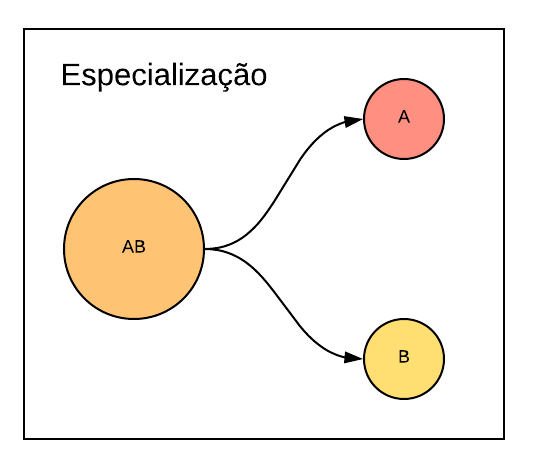
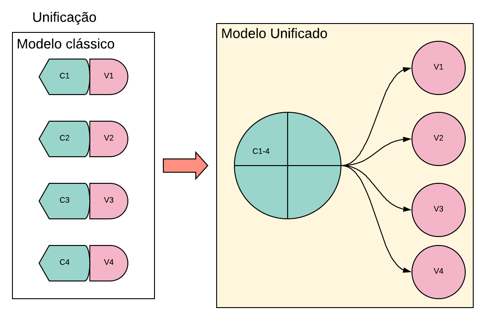
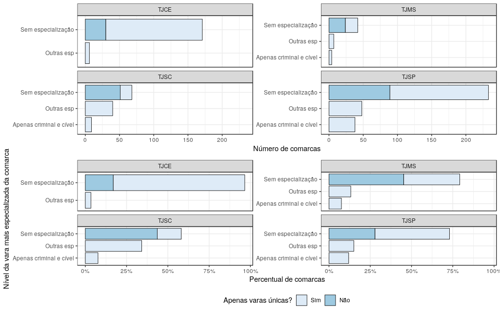
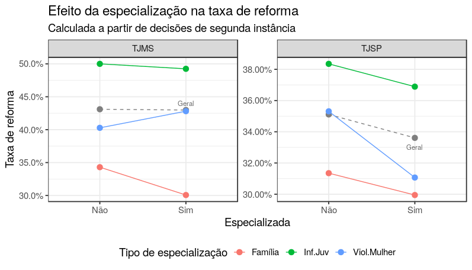
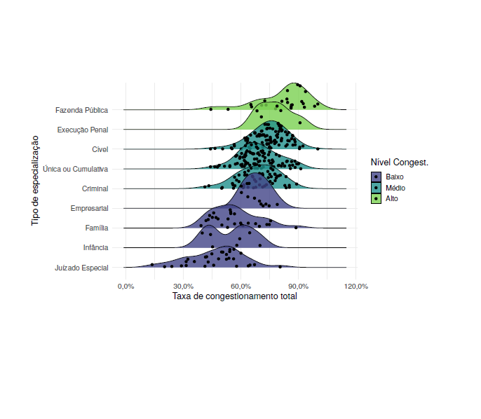

```{r setup, include=FALSE}
knitr::opts_chunk$set(
  echo = FALSE,
  fig.align = "center",
  out.width = "90%",
  message = FALSE,
  warning = FALSE
)

xaringanExtra::use_panelset()
xaringanExtra::use_scribble()
```

```{r meta, echo=FALSE}
library(metathis)
meta() %>%
  meta_general(
    description = "Case 09: Especialização da justiça",
    generator = "xaringan and remark.js"
  ) %>% 
  meta_name("github-repo" = "ndtj/main-jurimetria") %>% 
  meta_social(
    title = "Introdução à Jurimetria",
    url = "https://ndtj.github.io/main-jurimetria",
    image = "https://ndtj.com.br/img/logo.png",
    image_alt = "Logo do NDTJ.",
    og_type = "website",
    og_author = "Julio Trecenti",
    twitter_card_type = "summary_large_image",
    twitter_creator = "@jtrecenti"
  )
```


# Objetivos de aprendizagem de hoje

### Compreender o funcionamento da especialização

### Cases da ABJ relacionados a especialização

### Viscosidade processual

---
class: middle

# Guia para os slides

#### Slides sobre o case: __<span style="color:#3B0F70;">marca azul</span>__

#### Slides sobre pesquisa/ciência: __<span style="color:#7AD151;">marca verde</span>__

#### Slides sobre estatística: __<span style="color:#DE4968;">marca rosa</span>__

---
class: jurimetrics

# Especialização

```{r, out.width="80%"}

```


---
class: jurimetrics

## Unificação de serventias

```{r}

```

---
class: jurimetrics

# Vantagens e desvantagens

## especialização

.pull-left[

__Vantagens potenciais__

- Qualidade
- Uniformidade
- Inibe a escolha do foro
- Eficiência

]

.pull-right[

__Desvantagens potenciais__

- Custos
- Ineficiência
- Grupos de interesse
- Alienação

]

---
class: jurimetrics

# Balanceando as vantagens e desvantagens

- __Complexidade__: Existe complexidade na matéria ou no direito da competência almejada? A
- __Volume processual__: Existe volume processual suficiente para justificar a especialização?
- Separabilidade: É possível isolar a competência jurisdicional desejada de forma efetiva?
- __Uniformidade__: Há divergência considerável nos julgados dentre os casos que se enquadram no tipo que se deseja especializar?
- __Estudo piloto__: Há estudos anteriores sobre esta especialização?
- __Legislação adequada__: Quais as mudanças legislativas necessárias para especializar?
- __Celeridade__: Os casos que se enquadram nesta especialização tendem a demorar mais para serem julgados que os demais casos? 

---
class: jurimetrics

# Cuidados importantes ao especializar

- Treinamento

- Exclusividade de competência

- Instância correta

- Carreira

- Impedir isolamento

- Facilidade de acesso

- Acompanhamento

---
class: jurimetrics

# Critérios para avaliar uma especialização


- __Reversibilidade__: Essa quantidade é definida como a chance de uma decisão numa instância inferior ser reformada numa instância superior. A relação com a eficiência vem da ideia de uma aplicação da lei que é inconsistente entre as instâncias, indicando assim que a atuação dos operadores do Direito nas instâncias inferiores provoca uma litigância supérflua.

- __Previsibilidade__: Essa quantidade é definida como a variação no percentual de decisões favoráveis tomadas em condições iguais ou similares. Pelo mesmo motivo explicitado na métrica anterior, alguns autores consideram essa característica uma forma de insegurança jurídica com potencial para aumentar os litígios em instâncias superiores.

---
class: case

# Abrangência do estudo

- __Dados__: Módulo de Produtividade Mensal do CNJ e jurisprudência

- __Recorte territorial__: TJCE, TJSP, TJMS, TJSC

- __Recorte temporal__: 2015 a 2017 (MPM), e diversos recortes para dados de jurisprudência

---
class: case

# Panorama das especializações

```{r}

```

---
class: case

# Resultado: reforma

```{r}

```

---
class: case


# Resultado: congestionamento

```{r}

```

---
class: case

# Resultados gerais da pesquisa

```{r}
tab <- tibble::tribble(
  ~Tribunal, ~Congestionamento, ~Reforma, ~Tempo,
  "TJCE", "Reduz", "-", "Inconclusivo",
  "TJMS", "Inconclusivo", "Inconclusivo", "Reduz em parte",
  "TJSC", "Reduz", "Reduz", "Reduz em parte",
  "TJSP", "Reduz em parte", "Reduz", "Reduz em parte"
)
knitr::kable(tab)
```


---
class: inverse, middle

# Especialização das varas empresariais

https://abjur.github.io/tjspBook/

---
class: stats

# Viscosidade

https://github.com/abjur/tjspBook/blob/master/apresentacao/apresentacao.pdf

```{r}

```


---
class: jurimetrics

# Outros tópicos

- __Gravitação__: o aumento da eficiência pode gerar litigiosidade?

- __Jurisdição estendida__: Como aumentar a competência territorial das varas?

---

# Quiz

```{r, out.width="40%"}
knitr::include_graphics("img/cat.gif")
```

## https://forms.office.com/r/in3Vp284D3

---
class: center, middle, inverse

# Obrigado!

### [Julio Trecenti](mailto:jaztrecenti@pucsp.br)
